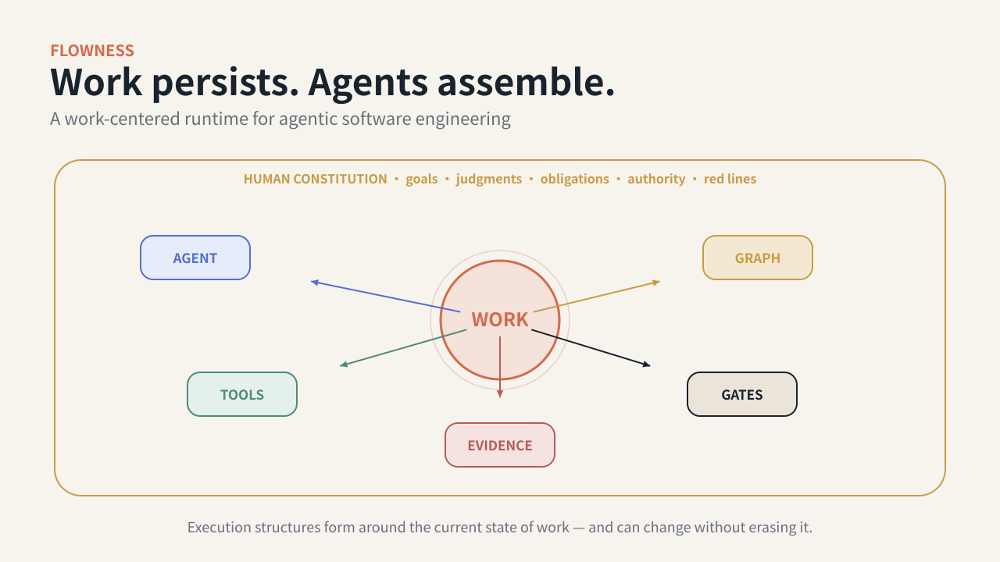
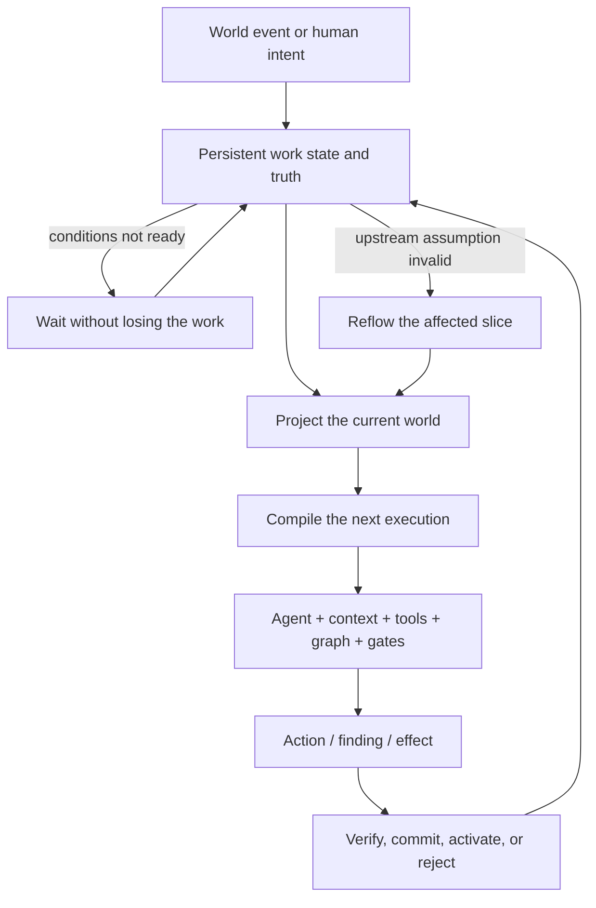

# Flowness

## Work persists. Agents assemble.

**Flowness is a work-centered runtime for agentic software engineering.**

It keeps engineering work alive across changing agents, sessions, contexts, and plans, then compiles the next execution from the current state of the world.

Humans define the goals, rules, judgments, and irreversible boundaries. Agents organize and act within them.

> *A session may end. The work keeps its name, its history, and its next question.*

[简体中文](README.zh-CN.md) · [Run the public proof](docs/open-alpha-demo.md) · [Flow Engineering](docs/concepts/FLOW_ENGINEERING.md) · [Architecture](docs/architecture/README.md) · [Failure Atlas](docs/failure-atlas/README.md)

> **Public status:** the Open Alpha now ships two deterministic proofs: **Work Outlives Agents**, which shows persistent work surviving executor death and recompiling its next execution, and the **Assurance Kernel**, which shows independent review, blocker lineage, targeted rework, and fresh acceptance. A complete organic public goal → accepted outcome remains the next proof boundary.



---

## The next unit of software engineering is not the session

Interactive coding agents are getting stronger. The bottleneck is moving.

A serious engineering task may outlive:

- the agent that started it;
- the context window that explained it;
- the first plan that organized it;
- the graph that routed it;
- the pull request that materialized one part of it.

Most agent systems still organize around one of those temporary containers. Flowness organizes around the **flow**.

```text
session-centered:  choose and supervise the next agent session

graph-centered:    choose the next node or transition

flow-centered:     read the work's current state,
                   determine what it now needs,
                   and assemble the next execution around it
```

**Agent does not own the flow. The flow temporarily assembles an agent.**

---

## From Harness to Flow

These engineering ideas are not competitors. They expand the object being engineered.

| Engineering focus | What it makes explicit |
|---|---|
| Prompt Engineering | The instruction given to a model |
| Context Engineering | The local world the model can see now |
| Harness Engineering | The environment, tools, rules, and feedback that let one agent act |
| Loop Engineering | How action observes, corrects, retries, and improves over time |
| Graph Engineering | How multiple execution units connect, branch, merge, and coordinate |
| **Flow Engineering** | **How work itself moves through changing execution structures and keeps finding a valid next step** |

A useful shorthand:

> **A loop is one execution unit unfolding through time.**  
> **A graph is many execution units organized in space.**  
> **A flow is work moving through a succession of graphs—and sometimes changing the graph itself.**

[Read the full concept](docs/concepts/HARNESS_LOOP_GRAPH_FLOW.md)

---

## The 30-second runtime model



Flow is not messages moving between agents. It is **work moving through changing execution assemblies**.

A healthy flow must do more than “keep running.” It must:

- **continue** instead of silently dying;
- **preserve identity and interpretation** instead of drifting while appearing green;
- **adapt** when the world invalidates an assumption;
- **commit** outputs into the system that actually consumes them;
- **close in reality**, not merely in an agent’s final message;
- **compound judgment** so the same structural failure becomes less likely next time.

---

## Six differences that matter

### 1. Flow first, agents second

The Flow is primary; Work is its addressable projection — it can split, merge, or be superseded, and the underlying facts live across Objects, Events, Obligations, Judgments, Evidence, and History. Work is the interface for finding that state, not a god object that holds it. Executors remain replaceable attempts, not the source of truth.

### 2. Graphs are projections, not prisons

A graph represents the work’s structure at a particular state and evidence cutoff. A finding, superseded concept, new dependency, or owner decision may invalidate part of that graph and require a new one.

### 3. Context is compiled from the current world

A Context Capsule is not a handoff summary. It is a bounded execution view assembled from authoritative state, active concepts, obligations, evidence, scope, and the action being attempted.

### 4. Reflow is deeper than retry

```text
re_execute → repair → replan → re_engineer → redesign → re_interview
```

The system should return to the nearest layer that must actually change. Repeating the last node is not a substitute for locating the broken assumption.

### 5. Human control is infrastructural, not conversational

Humans do not need to watch every transcript. They define the system’s constitution:

- goals and anti-goals;
- concepts and judgment cases;
- obligations and red lines;
- authority and irreversible boundaries;
- acceptance criteria and promotion rules.

The system may self-organize within that field. It may not silently invent the field.

> **Human out of the session, never out of the constitution.**

### 6. “Done” has multiple reality states

```text
Built ≠ Integrated ≠ Activated ≠ Accepted
```

Code can exist without being wired. A path can be wired without receiving organic use. Organic use can occur without the responsible owner accepting the result.

Flowness treats those as different states, with different evidence.

---

## Run the Flow proof

The public hero demo makes the core runtime claim visible: **an executor can die while the work remains alive**. It derives `WorkView`, context, graph snapshots, findings, and closure from a deterministic public trace.

```bash
.venv/bin/flowness-oss work-outlives-agents-demo \
  --output /tmp/flowness-flow-demo

.venv/bin/flowness-oss work-inspect \
  --work-id W-42 \
  --run-root /tmp/flowness-flow-demo
```

The trace must visibly contain a state where:

```text
agents: none
flow: alive
```

It then shows Graph v1 being superseded by Graph v2 after a consumer-wiring finding, and keeps `built`, `integrated`, `activated`, and `accepted` separate until organic evidence closes the work.

The existing deterministic **Assurance Kernel Demo** remains available. It demonstrates another narrow but load-bearing part of a trustworthy Flow:

- three isolated producers;
- a content-bound candidate;
- independent judges separated from producers;
- a mandatory finding that survives rework;
- targeted repair rather than full rerun;
- a fresh verdict over the successor candidate;
- an independently inspectable trace.

No model account is required.

```bash
git clone https://github.com/Towow-ai/Flowness.git
cd Flowness
python3.12 -m venv .venv
.venv/bin/python -m pip install -e ./oss/flowness-oss-harness

.venv/bin/flowness-oss open-alpha-demo \
  --output /tmp/flowness-open-alpha-demo

.venv/bin/flowness-oss open-alpha-demo-inspect \
  --run-root /tmp/flowness-open-alpha-demo
```

A successful inspection ends with:

```json
{"state":"verified","producer_agents":3,"round_1":"blocked","targeted_rework":"verified","round_2":"accepted"}
```

Together, the two demos prove persistent work continuity and evidence-backed acceptance. They still do not prove the complete Flow Engineering thesis or a full organic public goal → accepted outcome.

---

## What is actually available

Flowness uses evidence-status labels so architecture, dogfood, design, and shipped behavior are not blurred together.

| Status | Meaning |
|---|---|
| `[RUNNABLE]` | Reproducible from the public repository |
| `[INSPECTABLE]` | Public code, tests, or contracts exist, but not a complete public path |
| `[DOGFOOD]` | Used or observed in sustained private work; public evidence may be sanitized or incomplete |
| `[DESIGNED]` | Specified, or present as a pure component, but not connected into a complete runtime loop |
| `[OPEN QUESTION]` | A research target, not a capability claim |

### Public surface today

| Capability | Status | Public evidence |
|---|---|---|
| Execution → review → targeted rework → fresh acceptance | `[RUNNABLE]` | Open Alpha demo and inspector |
| Append-only events, projections, envelopes, gates, selected orchestration and closure mechanisms | `[INSPECTABLE]` | `harness/src/towow/`, public core, tests and conformance code |
| Design and engineering-spec objects, gates, CLI, and partial forward/reflow routes | `[DOGFOOD] / [INSPECTABLE]` | selected public schemas/docs; private runtime is partial |
| Full organic goal → accepted outcome on a new public target | `[OPEN QUESTION]` | not yet demonstrated publicly |
| WorkView CLI and “Work Outlives Agents” demo | `[RUNNABLE]` | deterministic hero demo, inspector, and release evidence manifest |
| General cross-domain Flow runtime | `[OPEN QUESTION]` | software engineering is the first proving ground |

[See the claims and evidence register](docs/benchmarks/CLAIMS_AND_EVIDENCE_REGISTER.md)

---

## The software-engineering Flow profile

Flowness’s first high-assurance domain profile progressively turns vague intent into falsifiable engineering work:

```text
goal
→ investigation / interview
→ problem and requirements
→ design alternatives and decisions
→ engineering specification
→ stable engineering consensus
→ dependency-aware plan
→ isolated execution
→ independent validation
→ targeted reflow
→ evidence-backed closure
```

This is **a Flow profile**, not the definition of every Flow. Small, reversible work should take a shorter route. High-impact work earns deeper design, engineering, authority, and acceptance gates.

[Read the profile](docs/architecture/SWE_FLOW_PROFILE.md)

---

## What the runtime is made of

```text
1. Human Constitution
   goals · ontology · judgments · obligations · policies · red lines

2. Persistent Work State & Truth
   event log · identities · versions · projections · history

3. Flow Compiler
   current-world view · context capsule · capabilities · graph · validators

4. Flow Runtime
   ready-set · dispatch · reconcile · liveness · recovery · reflow

5. Reality & Assurance
   artifacts · consumers · activation · effects · findings · acceptance
```

The current codebase maps broadly onto L0–L3:

- **L0 — Flow Kernel:** event log, projection, capsule, obligations, envelope, commit gate, snapshot;
- **L1 — Semantic and governance mechanisms:** goals, consensus, findings, judgments, closure, activation, consumer coverage;
- **L2 — Flow runtime:** dispatch, reconcile, liveness, dead-letter, reflow, invalidation;
- **L3 — Human control surface:** owner inbox, signals, views.

[Architecture set](docs/architecture/README.md) · [Repository guide](docs/codebase/REPOSITORY_GUIDE.md)

---

## Failure Atlas: what stronger models do not automatically remove

Flowness grew through months of dogfood, audits, and repeated structural failures. The public Failure Atlas organizes them by pathology rather than by embarrassment:

| Failure family | The question it asks |
|---|---|
| Formation | Why did the event never become executable work? |
| Continuity | Why did the work silently stop moving? |
| Integrity | Did identity, version, evidence, or interpretation drift? |
| Adaptation | Did changed facts invalidate old context and plans? |
| Commitment | Did a produced artifact enter the system that must consume it? |
| Closure | Did “done” correspond to reality and acceptance? |
| Learning | Did the system become less likely to repeat the same failure? |

Dogfood counts are reported as self-reported until their release evidence package is complete. The durable contribution is not a large number; it is a growing library of replayable cases with mechanism-off / mechanism-on comparisons.

[Open the Failure Atlas](docs/failure-atlas/README.md)

---

## Build your own cognitive exoskeleton

Flowness is not based on the belief that one universal harness will fit every team.

A harness becomes more powerful as it encodes the domain, habits, judgments, and acceptance standards of the people who use it. The general framework is therefore a **scaffold for building your own scaffold**.

What should compound:

```text
goals
+ concepts
+ judgments and counterexamples
+ obligations and exceptions
+ skills and policies
+ validators and acceptance standards
+ failure history
```

> **Models are replaceable. Your judgment should compound.**

[Read about the Cognitive Exoskeleton](docs/concepts/COGNITIVE_EXOSKELETON.md)

---

## Learn, borrow, or build

You do not have to adopt the whole runtime.

- **Learn** — use the concept kit, Failure Atlas, and design questions to audit your own agent system.
- **Borrow** — adapt one mechanism: event truth, Capsule compilation, obligations, reconcile, activation evidence, owner inbox, or acceptance lineage.
- **Build** — run the reference harness, implement a Flow profile, or contribute to the kernel/runtime.
- **Research** — reproduce a failure, implement a baseline, or run a FlowBench provider.

---

## Repository map

```text
Flowness/
├── harness/                         # canonical inspectable engine package
│   └── src/towow/
│       ├── l0/                      # kernel and truth substrate
│       ├── l1/                      # semantic/governance mechanisms
│       ├── l2/                      # dispatch, reconcile, liveness, reflow
│       ├── l3/                      # human control surface
│       ├── awareness/               # detection and system-health logic
│       ├── glue/                    # agent/tool integration surfaces
│       └── skills/                  # reusable execution/review/fix skills
├── oss/flowness-oss-harness/        # public Alpha package and CLI
├── public-core/flowness-ledger-core/# narrow public ledger core
├── docs/                            # concepts, architecture, cases, evidence
└── .github/                         # CI and community workflows
```

The public repository intentionally excludes live model credentials, private fleet/account state, private transcripts, and internal production topology. See the package, migration, license, and security documents before embedding Flowness into another system.

---

## Roadmap

The public roadmap is organized around evidence-bearing milestones, not feature volume:

1. **Make Work visible:** a read-only WorkView and `flowness work ...` CLI;
2. **Make Flow visible:** deterministic “Work Outlives Agents” demo;
3. **Prove one organic Flow:** a new public target from goal to accepted outcome;
4. **Make failures portable:** replayable Failure Clinic fixtures;
5. **Make claims falsifiable:** FlowBench qualification and ablations;
6. **Make judgment compound:** public JudgmentCase and regression examples.

[Roadmap](ROADMAP.proposed.md)

---

## Contributing

The highest-value contribution is not always a feature. Flowness welcomes:

- a reproducible structural failure;
- a counterexample to a concept or claim;
- a mechanism adapter for another harness;
- an independent baseline or benchmark provider;
- a clearer public explanation;
- a patch with explicit work state, affected projections, validation, and evidence.

Start with [CONTRIBUTING](CONTRIBUTING.proposed.md), open a structured issue, or join a GitHub Discussion.

---

## Naming and prior use

“Flow Engineering” has prior use, including AlphaCodium’s multi-stage test-driven code-generation flow and graph-oriented agent systems. Flowness does not claim to have coined the phrase.

Our narrower position is:

> **Flow Engineering should treat the flow—not the prompt, session, agent, or graph—as the primary engineering object. Work is the flow's addressable projection.**

[Related work and naming boundary](docs/whitepaper/flow-engineering-whitepaper.en.md#prior-use-and-positioning)

---

## License, citation, and security

Code and documentation may carry different licenses. Check [LICENSE](LICENSE), [LICENSE-MATRIX.md](LICENSE-MATRIX.md), and [NOTICE](NOTICE) in the repository before redistribution.

For academic or technical citation, use [CITATION.cff](CITATION.cff). Do not report security vulnerabilities in public issues; follow [SECURITY.md](SECURITY.md).

---

## Maintainer note

Flowness is built by a small independent team working with AI. That creates real constraints and a useful discipline: the project will prefer fewer mechanisms with inspectable contracts, replayable failures, and honest boundaries over a long feature list that cannot be maintained.

The project is ambitious about the direction and deliberately cautious about what the current release proves.


---

[FAQ](docs/community/FAQ.md) · [Governance](GOVERNANCE.md) · [Contributing](CONTRIBUTING.proposed.md)
