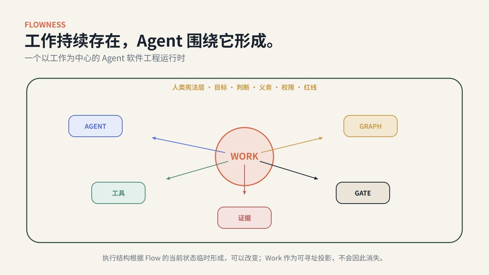
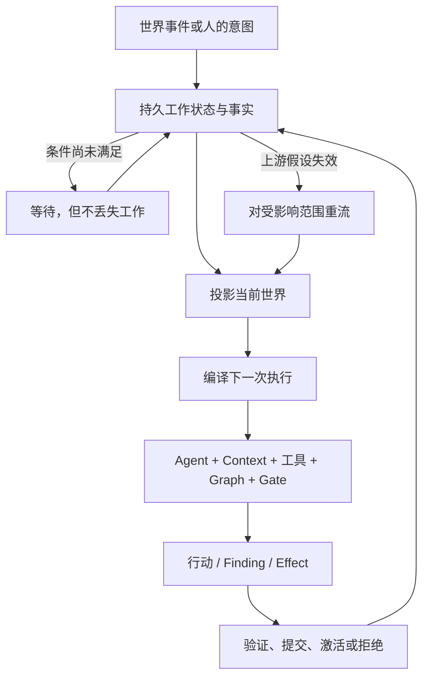

# Flowness

## 工作持续存在，Agent 围绕它形成。

**Flowness 是一个以工作为中心的 Agent 软件工程运行时。**

它让工程工作跨越不断变化的 Agent、会话、上下文和计划持续存在，并依据当前世界状态编译下一次执行。

人定义目标、规则、判断和不可逆边界；Agent 在其中自组织并行动。

> **水无常形，事有其脉；会话会散，工作继续。**

[English](README.md) · [运行公开证明](docs/open-alpha-demo.md) · [Flow 工程](docs/concepts/FLOW_ENGINEERING.md) · [架构](docs/architecture/README.md) · [Failure Atlas](docs/failure-atlas/README.md)

> **当前公开状态：** Open Alpha 现在包含两个确定性证明：**Work Outlives Agents** 展示持久工作如何跨越执行者死亡并重新编译下一次执行；**Assurance Kernel** 展示独立审查、Blocker Lineage、定向返工与 fresh acceptance。完整有机的公开 goal → accepted outcome 仍是下一条证明边界。



---

## 软件工程的下一个基本单位，不是会话

交互式 Coding Agent 越来越强，瓶颈正在迁移。

一项严肃工程工作可能比以下任何对象活得更久：

- 发起它的 Agent；
- 解释它的 Context Window；
- 组织它的第一版计划；
- 路由它的第一张 Graph；
- 只落地其中一部分的 Pull Request。

大多数 Agent 系统仍围绕这些临时容器组织。Flowness 围绕**Flow 本身**组织。

```text
会话中心：监督下一个 Agent 会话

Graph 中心：选择下一个节点或转移

Flow 中心：读取工作当前的状态，
           判断它现在缺什么，
           并围绕它组织下一次执行
```

**不是 Agent 拥有 Flow，而是 Flow 临时召集 Agent。**

---

## 从 Harness 到 Flow

这些工程概念并不互相取代。它们不断扩大被工程化的对象。

| 工程视角 | 它明确了什么 |
|---|---|
| Prompt Engineering | 给模型的一次指令 |
| Context Engineering | 模型此刻能够看到的局部世界 |
| Harness Engineering | 一个 Agent 行动所需的环境、工具、规则和反馈 |
| Loop Engineering | 行动如何跨时间观察、修正、重试和改进 |
| Graph Engineering | 多个执行单元如何连接、分叉、合流和协调 |
| **Flow Engineering** | **工作本身如何穿过不断变化的执行结构，持续形成有效下一步** |

一个容易记住的关系：

> **Loop 是一个执行单元在时间中的展开。**  
> **Graph 是多个执行单元在空间中的组织。**  
> **Flow 是工作跨越一系列 Graph 的持续运动——并且有时会重新生成 Graph。**

[阅读完整概念](docs/concepts/HARNESS_LOOP_GRAPH_FLOW.md)

---

## 30 秒运行模型



Flow 不是消息在 Agent 之间传递，而是**工作穿过不断变化的执行组织持续前进**。

健康的 Flow 不能只做到“还在跑”，还必须：

- **能继续**：不会无声停流；
- **不变质**：身份、版本、证据和解释不会在绿色表象下漂移；
- **能适应**：世界变化后旧假设和旧路径能够失效；
- **能承诺**：产物真正进入需要消费它的系统；
- **能闭合**：完成对应现实 Effect 与负责人的接受，而非 Agent 的最后一句话；
- **能积累**：同类失败下一次更不容易发生。

---

## 六个真正承重的差异

### 1. Flow 优先，Agent 在后

Flow 是一等运行对象，Work 是它的可寻址投影——可拆分、合并或被取代，深层事实分布在 Object、Event、Obligation、Judgment、Evidence 与 History 之中。Work 是定位状态的查询面，不是持有一切的上帝对象。执行者仍是可替换的一次尝试，不是事实源。

### 2. Graph 是投影，不是牢笼

Graph 表示某一个事实 cutoff 上工作的结构。Finding、Concept supersede、新依赖或 Owner 决策都可能让其中一部分失效，并形成新的 Graph。

### 3. Context 从当前世界编译

Context Capsule 不是交接摘要。它从权威状态、活跃概念、义务、证据、Scope 和当前动作中编译出一个有边界的执行世界。

### 4. Reflow 比 Retry 更深

```text
re_execute → repair → replan → re_engineer → redesign → re_interview
```

系统应回到真正需要改变的最近一层。重复最后一个节点，不能替代对失效假设的定位。

### 5. 人的控制是基础设施级的，不是会话级的

人不需要阅读每一份 transcript。人定义系统的“宪法”：

- 目标与反目标；
- 概念与 JudgmentCase；
- Obligation 与红线；
- 权限与不可逆边界；
- 验收标准与晋升规则。

系统可以在这个场地内自组织，但不能悄悄发明场地。

> **人可以退出会话，但不能退出系统的宪法。**

### 6. “做完”包含多个现实状态

```text
做出来 ≠ 接进去 ≠ 真正在用 ≠ 已被接受
```

代码可以存在但没有接线；路径可以接线但没有真实使用；真实使用可以发生但尚未由负责人接受。Flowness 把它们作为不同状态，并要求不同证据。

---

## 运行 Flow 证明

公开 Hero Demo 让核心运行时主张可见：**执行者可以死亡，但工作仍然活着。** 它从确定性公开 trace 中派生 WorkView、Context、Graph Snapshot、Finding 与 Closure。

```bash
.venv/bin/flowness-oss work-outlives-agents-demo \
  --output /tmp/flowness-flow-demo

.venv/bin/flowness-oss work-inspect \
  --work-id W-42 \
  --run-root /tmp/flowness-flow-demo
```

Trace 必须真实出现：

```text
agents: none
flow: alive
```

随后它展示 Consumer Wiring Finding 如何使 Graph v1 被 Graph v2 替代，并在获得真实证据前持续区分 `built`、`integrated`、`activated` 与 `accepted`。

原有确定性的 **Assurance Kernel Demo** 继续保留，它证明可信 Flow 中另一个狭窄但承重的部分：

- 三个隔离 Producer；
- 与内容绑定的候选结果；
- 与生产者分离的独立 Judge；
- Mandatory Finding 在返工后继续存活；
- 定向修复而不是整轮重跑；
- 对后继候选重新出具 fresh verdict；
- 结果轨迹可独立检查。

默认模式不需要模型账号。

```bash
git clone https://github.com/Towow-ai/Flowness.git
cd Flowness
python3.12 -m venv .venv
.venv/bin/python -m pip install -e ./oss/flowness-oss-harness

.venv/bin/flowness-oss open-alpha-demo \
  --output /tmp/flowness-open-alpha-demo

.venv/bin/flowness-oss open-alpha-demo-inspect \
  --run-root /tmp/flowness-open-alpha-demo
```

成功检查会以以下结果结束：

```json
{"state":"verified","producer_agents":3,"round_1":"blocked","targeted_rework":"verified","round_2":"accepted"}
```

两套 Demo 共同证明持久工作连续性与证据化闭合，但仍不代表完整 Flow Engineering 主张或公开有机 goal → accepted outcome 已被证明。

---

## 当前到底有什么

Flowness 通过统一状态标签区分架构、私有实践、设计与公开可运行能力。

| 状态 | 含义 |
|---|---|
| `[RUNNABLE]` | 可以从公开仓库直接复现 |
| `[INSPECTABLE]` | 有公开代码、测试或合同，但没有完整公开路径 |
| `[DOGFOOD]` | 在长期私有实践中使用或观察，公开证据可能脱敏或不完整 |
| `[DESIGNED]` | 已有规格，或存在纯组件，但未接入完整运行闭环 |
| `[OPEN QUESTION]` | 研究目标，不是能力声明 |

### 当前公开面

| 能力 | 状态 | 公开证据 |
|---|---|---|
| 执行 → 审查 → 定向返工 → fresh acceptance | `[RUNNABLE]` | Open Alpha demo 与 inspector |
| Append-only event、projection、envelope、gate、部分 orchestrator 与 closure 机制 | `[INSPECTABLE]` | `harness/src/towow/`、public core、测试与 conformance |
| Design / Engineering Spec 对象、Gate、CLI 与部分 forward/reflow 路由 | `[DOGFOOD] / [INSPECTABLE]` | 部分公开 Schema/文档；私有运行时仍在接线 |
| 新公开目标的 goal → accepted outcome 有机端到端 | `[OPEN QUESTION]` | 尚未公开证明 |
| WorkView CLI 与 “Work Outlives Agents” Demo | `[RUNNABLE]` | 确定性 Hero Demo、Inspector 与 release evidence manifest |
| 通用跨领域 Flow Runtime | `[OPEN QUESTION]` | 先在软件工程中证明 |

[查看 Claim 与 Evidence Register](docs/benchmarks/CLAIMS_AND_EVIDENCE_REGISTER.md)

---

## 软件工程 Flow Profile

Flowness 的第一套高可信领域 Profile，把模糊意图逐步变成可证伪的工程工作：

```text
goal
→ investigation / interview
→ problem and requirements
→ design alternatives and decisions
→ engineering specification
→ stable engineering consensus
→ dependency-aware plan
→ isolated execution
→ independent validation
→ targeted reflow
→ evidence-backed closure
```

它是**一套 Flow Profile**，而不是所有 Flow 的定义。小、可逆工作应走短路；高影响工作才值得进入更深的设计、工程、Authority 和 Acceptance Gate。

[阅读软件工程 Profile](docs/architecture/SWE_FLOW_PROFILE.md)

---

## 运行时由什么构成

```text
1. Human Constitution
   目标 · 本体 · 判断 · 义务 · Policy · 红线

2. Persistent Work State & Truth
   Event Log · 身份 · 版本 · Projection · 历史

3. Flow Compiler
   当前世界 · Capsule · Capability · Graph · Validator

4. Flow Runtime
   Ready-set · Dispatch · Reconcile · Liveness · Recovery · Reflow

5. Reality & Assurance
   Artifact · Consumer · Activation · Effect · Finding · Acceptance
```

当前代码大体映射到 L0–L3：

- **L0 — Flow Kernel：** Event Log、Projection、Capsule、Obligation、Envelope、Commit Gate、Snapshot；
- **L1 — 语义与治理机制：** Goal、Consensus、Finding、Judgment、Closure、Activation、Consumer Coverage；
- **L2 — Flow Runtime：** Dispatch、Reconcile、Liveness、Dead-letter、Reflow、Invalidation；
- **L3 — 人类控制面：** Owner Inbox、Signal、View。

[架构图集](docs/architecture/README.md) · [代码结构指南](docs/codebase/REPOSITORY_GUIDE.md)

---

## Failure Atlas：强模型不会自动消除的结构性失败

Flowness 来自数月 dogfood、审计和反复出现的系统性错误。Failure Atlas 不把它们当作自嘲，而是按病理机制组织：

| 失败族 | 它问什么 |
|---|---|
| Formation | 事件为什么没有形成可执行工作？ |
| Continuity | 工作为什么沉默停流？ |
| Integrity | 身份、版本、证据或解释是否漂移？ |
| Adaptation | 事实变化后旧 Context 和旧 Plan 是否失效？ |
| Commitment | 产物是否进入真正消费它的系统？ |
| Closure | “完成”是否对应现实 Effect 与 Acceptance？ |
| Learning | 同类失败为什么下一次还会发生？ |

Dogfood 数字在正式 release evidence 完成前统一标记为 self-reported。真正可复用的资产不是一个大数字，而是一组可以回放的：机制关闭时复现、机制开启时捕获、剩余边界明确的案例。

[打开 Failure Atlas](docs/failure-atlas/README.md)

---

## 搭建你自己的认知外骨骼

Flowness 不相信一套万能 Harness 可以适合所有人。

Harness 越能编码具体领域、个人习惯、判断方式与验收标准，它通常越有力量。因此通用框架更像“脚手架的脚手架”。

真正应该持续累积的是：

```text
目标
+ 概念
+ 判断与反例
+ 义务与例外
+ Skill 与 Policy
+ Validator 与 Acceptance 标准
+ 失败历史
```

> **模型可以替换，你的判断应当累积。**

[阅读认知外骨骼](docs/concepts/COGNITIVE_EXOSKELETON.md)

---

## Learn、Borrow、Build

你不必采用完整运行时。

- **Learn：** 用概念包、Failure Atlas 与设计问题审计自己的 Agent 系统；
- **Borrow：** 借用 Event Truth、Capsule、Obligation、Reconcile、Activation Evidence、Owner Inbox 或 Acceptance Lineage；
- **Build：** 运行参考 Harness、实现领域 Profile 或贡献 Kernel/Runtime；
- **Research：** 复现一个失败、实现 Baseline 或运行一个 FlowBench Provider。

---

## 仓库地图

```text
Flowness/
├── harness/                         # 可检查的 canonical engine package
│   └── src/towow/
│       ├── l0/                      # Kernel 与事实底座
│       ├── l1/                      # 语义与治理机制
│       ├── l2/                      # Dispatch、Reconcile、Liveness、Reflow
│       ├── l3/                      # 人类控制面
│       ├── awareness/               # 检测与系统健康
│       ├── glue/                    # Agent / Tool 集成面
│       └── skills/                  # Execution / Review / Fix Skills
├── oss/flowness-oss-harness/        # Open Alpha package 与 CLI
├── public-core/flowness-ledger-core/# 窄公开 Ledger Core
├── docs/                            # 概念、架构、案例、证据
└── .github/                         # CI 与社区工作流
```

公开仓库有意排除模型凭证、私有账号与 fleet 状态、私有 transcript 和内部生产拓扑。嵌入其他系统前，请检查 package scope、migration、license 与 security 文档。

---

## 路线图

公开路线图围绕可验证里程碑，而不是功能数量：

1. **让 Work 可见：** WorkView projection 与 `flowness work ...` CLI；
2. **让 Flow 可见：** 确定性的 “Work Outlives Agents” Demo；
3. **证明一个有机 Flow：** 新公开目标从 goal 到 accepted outcome；
4. **让失败可移植：** 可回放的 Failure Clinic fixture；
5. **让主张可证伪：** FlowBench qualification 与 ablation；
6. **让判断可累积：** 公共 JudgmentCase 与 regression 示例。

[路线图](ROADMAP.proposed.md)

---

## 参与贡献

最有价值的贡献不一定是新功能。Flowness 欢迎：

- 一个可复现的结构性失败；
- 对概念或主张的反例；
- 把某个机制接到其他 Harness 的 Adapter；
- 独立 Baseline 或 Benchmark Provider；
- 更清楚的公共解释；
- 一份明确 Work 状态、受影响 Projection、验证与证据的 Patch。

从 [CONTRIBUTING](CONTRIBUTING.proposed.md) 开始，提交结构化 Issue，或进入 GitHub Discussion。

---

## 命名边界

“Flow Engineering” 不是 Flowness 首创。AlphaCodium 曾用它描述多阶段、测试驱动的代码生成 Flow，Graph 型 Agent 系统也使用过相近表达。

Flowness 的更窄主张是：

> **Flow 工程应当把 Flow 本身，而不是 Prompt、Session、Agent 或 Graph，作为第一工程对象；Work 是 Flow 可寻址的投影。**

[相关工作与命名边界](docs/whitepaper/flow-engineering-whitepaper.zh-CN.md#既有使用与定位边界)

---

## License、引用与安全

代码和文档可能使用不同许可证。转载或嵌入前请检查仓库中的 [LICENSE](LICENSE)、[LICENSE-MATRIX.md](LICENSE-MATRIX.md) 与 [NOTICE](NOTICE)。

学术或技术引用使用 [CITATION.cff](CITATION.cff)。安全漏洞不要提交到公开 Issue，请遵循 [SECURITY.md](SECURITY.md)。

---

## 维护者说明

Flowness 由一个很小的独立团队与 AI 共同建设。这构成真实约束，也构成一种纪律：宁愿维护更少但合同清楚、失败可回放、边界诚实的机制，也不追求无法长期维护的功能表。

项目对方向保持野心，对当前 release 能证明什么保持克制。


---

[FAQ](docs/community/FAQ.md) · [Governance](GOVERNANCE.md) · [Contributing](CONTRIBUTING.proposed.md)
