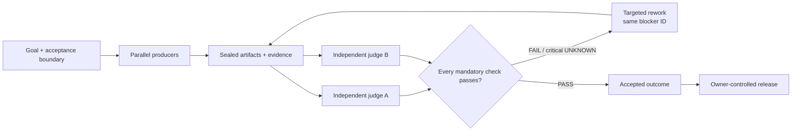

<!-- SPDX-License-Identifier: CC-BY-4.0 -->

# Flowness

Flowness is an evidence-driven multi-agent engineering Harness. It turns one
goal into parallel work, sealed artifacts, independent judgment, targeted
rework, and a traceable accepted outcome.

This repository is the Flowness `v1.0.0-alpha` open-source line, evolved from
Wow-Harness `v0.x`. Open Alpha means the code and a canonical demonstration are
inspectable and runnable. It does **not** mean production reliability, scale,
security hardening, benchmark leadership, or external adoption has been
established.

## The acceptance loop



A credible `FAIL` or critical `UNKNOWN` cannot disappear into an average
score. The blocker remains visible through a bounded successor and fresh
retest.

## 10-minute quickstart

The intended first independently accepted Open Alpha coordinate is **Linux
aarch64 with CPython 3.12**. This source tree cannot carry or authorize its own
acceptance: the coordinate is claimable only when an external immutable release
record binds the exact commit, sealed export, retained non-author clean-room
receipt, and fresh jury decision. Run the commands from a **Git checkout**, not
from the immutable root of a bare sealed export:

```bash
python3.12 -m venv .venv
.venv/bin/python -m pip install -e ./oss/flowness-oss-harness
.venv/bin/flowness-oss open-alpha-demo \
  --output /tmp/flowness-open-alpha-demo
.venv/bin/flowness-oss open-alpha-demo-inspect \
  --run-root /tmp/flowness-open-alpha-demo
```

The demo runs three isolated producers, blocks its first candidate on one
credible failure, performs targeted rework, retests with two fresh judges, and
then verifies the content-addressed trace. It is deterministic and does not
need a model account. See the [guided demo](oss/flowness-oss-harness/docs/open-alpha-demo.md)
for the artifact map and optional Codex CLI producer mode.

No operating-system, architecture, or interpreter coordinate is independently
accepted by this mutable candidate. Other coordinates may work, but are also
unverified until a future exact release record binds their external evidence.

### Verification coordinates

The full public CI workflow is supported from a Git checkout, including GitHub
Actions, because scope tests inspect the tracked-file index. A bare sealed-export
directory deliberately has no `.git`; verify its bytes with
`python -m flowness_oss_harness.rc0_sealed_export verify`, then use the separate
clean-room acceptance entry for installation and E2E evidence. A bare export is
not claimed to be a drop-in GitHub Actions checkout. Never create `.venv`, test
output, or bytecode inside it; copy the selected packages to scratch space first.

## Monorepo map

| Path | What it contains | Alpha status |
| --- | --- | --- |
| [`harness/`](harness/README.md) | Selected canonical EventLog, projection, orchestration, review, recovery, lock, worktree, and portable-entry mechanisms | Experimental public engine; real-agent spawning requires a separately authorized adapter |
| [`oss/flowness-oss-harness/`](oss/flowness-oss-harness/README.md) | Multi-agent roles, candidate sealing, independent jury, blocker/rework lineage, release checks, registries, and the runnable demo | Experimental public OSS machine |
| [`public-core/flowness-ledger-core/`](public-core/flowness-ledger-core/README.md) | Append-only decisions, projection freshness, terminal verdicts, and bounded tail recovery | Narrow stable candidate |
| [`oss/flowness-oss-harness/docs/`](oss/flowness-oss-harness/docs/) | Architecture, mechanism, evidence, benchmark, demo, and communication contracts | Mixed current, experimental, target, and Unknown labels; read each proof ceiling |

Credentials, customer material, raw Transcripts, account/quota/fleet control,
private server configuration, and private runtime ledgers are not part of the
Open Alpha.

## Choose your route

- **Run it:** [10-minute FAIL → rework → PASS demo](oss/flowness-oss-harness/docs/open-alpha-demo.md)
- **Understand it:** [D0–D9 Architecture Atlas](oss/flowness-oss-harness/docs/architecture-atlas.md)
- **Evaluate fit:** [Open Alpha selector packet](oss/flowness-oss-harness/docs/open-alpha-selector-packet-v0.md)
- **Reuse the public story:** [Discovery and launch pack](oss/flowness-oss-harness/docs/open-alpha-discovery-launch-pack-v0.md)
- **Inspect boundaries:** [Open Alpha package scope](oss/flowness-oss-harness/docs/open-alpha-package-scope-v0.md)
- **Migrate from v0:** [Wow-Harness migration guide](MIGRATION.md)

The Architecture Atlas deliberately separates current, experimental,
designed-target, blocked, and Unknown elements. A diagram or design target is
not implementation evidence.

## From Wow-Harness to Flowness

Flowness is a ground-up major-version evolution of Wow-Harness, not an
unrelated project borrowing its history. The migration preserves the v0 Git
history and license while replacing the current tree through a reviewable
major-version commit; it does not rewrite history or promise v0 compatibility.

Historical stars, forks, issues, pull requests, and contributors show interest
in and use of Wow-Harness. They do **not** validate the rewritten Flowness v1
implementation. See [MIGRATION.md](MIGRATION.md) for legacy refs, breaking
boundaries, and issue classification.

## Contributing and governance

- [Contributing](CONTRIBUTING.md)
- [Security](SECURITY.md)
- [Code of Conduct](CODE_OF_CONDUCT.md)
- [Version-level license matrix](LICENSE-MATRIX.md)
- [Apache-2.0 license text](LICENSE)
- [Notice](NOTICE)

Experimental interfaces may change before Beta. Claims about an external
selection opportunity, endorsement, criteria, or deadline require a verified
primary source; this repository makes none merely because an opportunity was
reported to the project.
