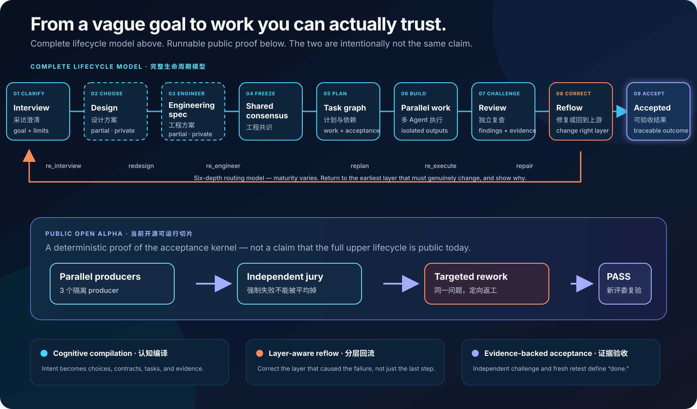
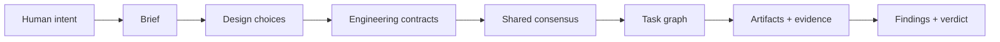
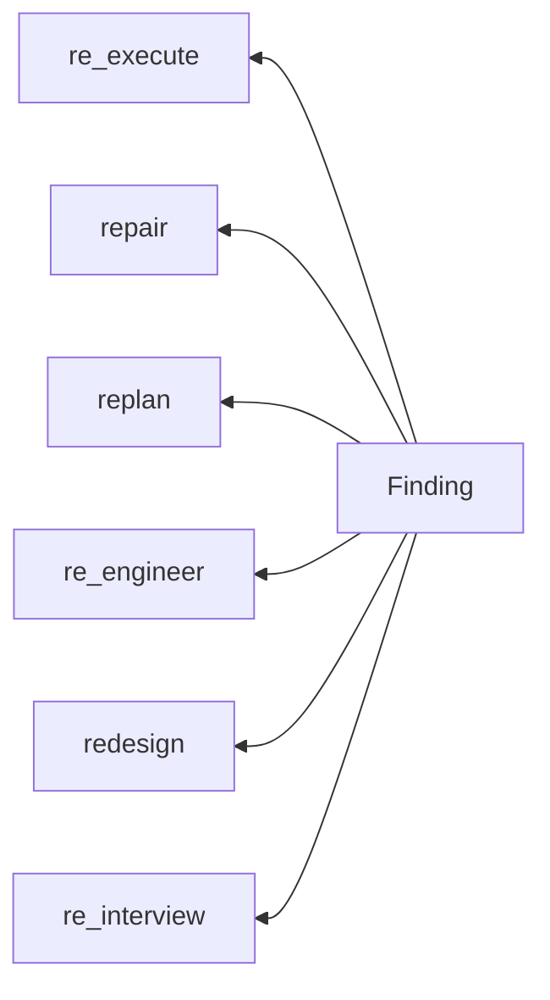
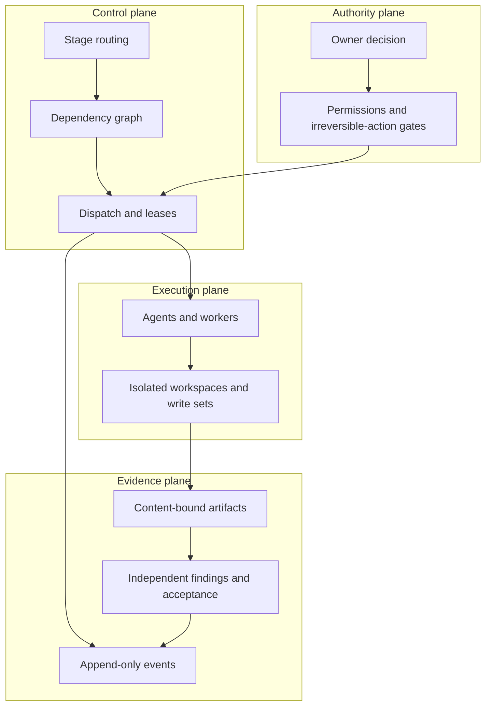

<!-- SPDX-License-Identifier: CC-BY-4.0 -->

# Flowness architecture: from intent to accepted work

[简体中文](architecture.zh-CN.md) · [Back to README](../README.md)

This is the current reader-facing architecture map. It separates three things
that are easy to confuse:

1. the complete lifecycle Flowness is designed around;
2. what exists, partially exists, or remains unproven in the private runtime;
3. what the public Open Alpha can actually run today.

## D0 — Why another agent harness?

Coding agents are already fast. The harder failure is loss of intent across
handoffs: why a direction was chosen, which constraints cannot move, what every
agent must agree on, what evidence belongs to which candidate, and what “done”
means. Flowness treats those as first-class engineering state.

## D1 — The lifecycle model

```mermaid
flowchart LR
    A["Goal"] --> B["Interview"]
    B --> C["Design"]
    C --> D["Engineering specification"]
    D --> E["Engineering consensus"]
    E --> F["Plan and task graph"]
    F --> G["Parallel execution"]
    G --> H["Independent review"]
    H --> I["Fix or upstream reflow"]
    I --> J["Accepted outcome"]
```

The stages are different types of work:

| Stage | Input | Authoritative output |
| --- | --- | --- |
| Interview | Ambiguous goal and available context | Confirmable brief, constraints, open information needs |
| Design | Brief | Alternatives, trade-offs, scenarios, predictions, frozen design |
| Engineering specification | Frozen design | Components, interfaces, state, failures, parameters, tests, migration and operations |
| Engineering consensus | Engineering dossier | Versioned facts and invariants every downstream consumer must share |
| Planning | Frozen upstream references | Dependency graph, task contracts, ownership and acceptance conditions |
| Execution | Admissible tasks | Isolated artifacts, evidence and declared write sets |
| Review/fix | Content-bound candidate and policy | Findings, targeted successor evidence and fresh verdict |

The design stage asks: **what structure could produce the intended result, and
how could that belief be falsified?** The engineering-spec stage asks: **how is
that structure implemented, tested, migrated, operated, and recovered without
agents inventing incompatible answers?** Engineering consensus then extracts
the smaller set of stable facts every task must share.

## D2 — Cognitive compilation

Flowness calls this **cognitive compilation**. It is not a request for more
documents. An upstream artifact matters only if it constrains downstream
behavior and can be inspected when the result fails.

## D3 — Failure goes back to the right layer

The six-depth model is implemented unevenly. The routing schema, CLI, and
exclusion-chain contract exist; `replan` has real history, while design and
engineering reflow are still being closed and organically proven. This diagram
is a routing model, not a claim that every path has equal runtime evidence.

## D4 — Control, execution, evidence, and authority

Execution state is not inferred from a polished summary. Events, projections,
artifacts, findings, and acceptance records each have a defined authority and
consumer. A producer cannot clear its own mandatory failure.

## D5 — Current truth boundary

| Surface | Evidence state as of 2026-08-03 |
| --- | --- |
| Public execution → review → targeted rework → acceptance demo | Runnable Open Alpha |
| Public ledger and selected orchestration/review/recovery mechanisms | Experimental, inspectable, locally tested |
| Private interview, consensus, plan, execution, review and fix stages | Existing runtime history; not exported as the public product |
| Private design and engineering-spec stages | Main objects, CLI, gates, skills, tests and partial routes exist; automatic tier routing and engineering-spec → consensus publishing are not closed |
| Organic new-task goal → design → engineering → accepted-result run | Not yet demonstrated |
| Comparative efficiency or benchmark leadership | Not established |

The next decisive proof is not another diagram. It is an open, real task that
enters with an ambiguous goal, uses the design and engineering stages, produces
an accepted result, and retains a baseline, cost, time, failures, and replayable
evidence.

## Go deeper

- [Open Alpha demo](../oss/flowness-oss-harness/docs/open-alpha-demo.md)
- [Design × engineering rings (Chinese-first, English summary)](design-engineering-rings.zh-CN.md)
- [D0–D9 Open Alpha mechanism Atlas](../oss/flowness-oss-harness/docs/architecture-atlas.md)
- [Mechanism Registry](../oss/flowness-oss-harness/registries/mechanism-registry-seed-v0.json)
- [Drift Atlas](../oss/flowness-oss-harness/docs/drift-atlas-seed-v0.md)
- [Benchmark protocol](../oss/flowness-oss-harness/docs/benchmark-protocol.md)

The older D0–D9 Atlas contains useful lower-level evidence, but its D1/D2 views
predate the reconstructed design and engineering-spec stages. This page is the
canonical lifecycle entry until those generated views are rebuilt.
