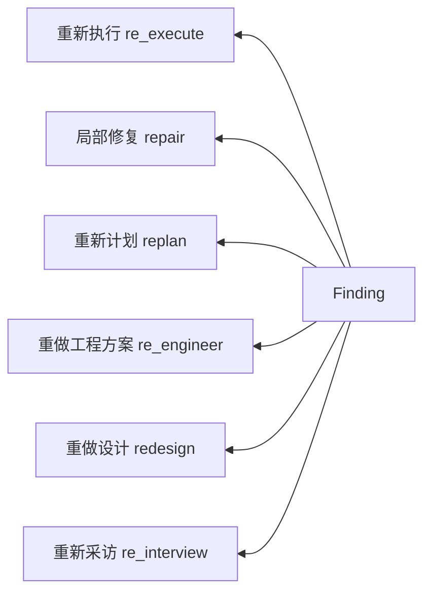
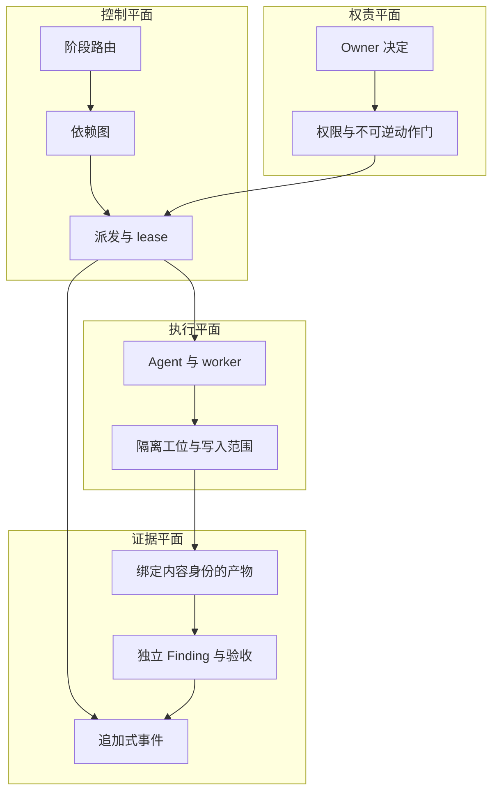

<!-- SPDX-License-Identifier: CC-BY-4.0 -->

# Flowness 架构：从人的意图到真正可验收的结果

[English](architecture.md) · [返回中文 README](../README.zh-CN.md)

这份文档是当前面向读者的架构入口。它特意把三件容易混淆的事分开：

1. Flowness 设计中的完整生命周期；
2. 私有运行时中哪些已存在、部分存在或尚未证明；
3. 当前公开 Open Alpha 到底能运行什么。

## D0：为什么还需要一个 Agent Harness？

编码 Agent 已经很快，真正困难的是每次交接都会丢东西：为什么选择这个方向、哪些约束
不能变、所有 Agent 必须共同服从什么、证据属于哪个候选版本，以及怎样才算真的完成。
Flowness 把这些变成一等工程状态，而不是留在聊天记录或个人记忆里。

## D1：完整生命周期模型

这些环节不是把同一份文档换几个名字：

| 环节 | 输入 | 权威产物 |
| --- | --- | --- |
| 采访 | 模糊目标和可用上下文 | 可确认的 brief、约束、未决信息 |
| 设计方案 | Brief | 备选方向、取舍、场景、预测和冻结后的设计方案 |
| 工程方案 | 冻结设计 | 组件、接口、状态、失败语义、参数、测试、迁移与运行方案 |
| 工程共识 | 完整工程方案 | 所有下游必须共享的版本化事实和不变量 |
| 计划 | 已冻结的上游引用 | 依赖图、任务契约、所有权和验收条件 |
| 执行 | 可派发任务 | 隔离产物、证据和声明的写入范围 |
| 复查/修复 | 与内容身份绑定的候选和策略 | Finding、定向后继证据和新一轮 verdict |

设计方案回答：**什么结构可能产生目标结果，我们怎样在实现前证明这个判断可能是错的？**
工程方案回答：**这个结构具体怎样实现、测试、迁移、运行和恢复，才能避免不同 Agent
各自编造一套答案？**工程共识再从完整工程方案中抽取所有任务必须共同遵守的稳定事实。

## D2：认知编译

Flowness 把这个过程称为**认知编译**。它不是要求写更多文档。一个上游产物只有真正
约束下游行为，并且在失败时可以反查，才有存在价值。

## D3：失败要回到真正出错的那一层

六级回流的成熟度并不相同。路由 schema、CLI 和排除链契约已经存在，`replan` 有真实
历史；设计与工程方案回流仍在收口并等待真实任务验证。因此这是一张路由模型图，不代表
六条路线已经拥有同等强度的运行证据。

## D4：控制、执行、证据与权责四个平面

系统不会从一份漂亮总结推断真实执行状态。Event、projection、artifact、Finding 和
acceptance 各有自己的权威来源与消费方；生产者不能自行清除自己的强制失败。

## D5：截至 2026-08-03 的真实边界

| 能力 | 证据状态 |
| --- | --- |
| 公开“执行 → 复查 → 定向返工 → 验收”demo | Open Alpha 可运行 |
| 公开 ledger 及部分编排、复查、恢复机制 | 实验性，可审阅，本地测试通过 |
| 私有采访、共识、计划、执行、复查与修复环节 | 有真实运行历史，但没有作为完整产品导出 |
| 私有设计方案和工程方案环节 | 主要对象、CLI、门、Skill、测试和部分路线已存在；自动分级及“工程方案 → 共识”发布链尚未闭环 |
| 新任务从目标经过设计/工程方案到验收结果的完整真实运行 | 尚未证明 |
| 效率提升比例或 benchmark 领先 | 尚未建立 |

下一项决定性证据不是再画一张图，而是开放一个真实任务：从模糊目标进入，实际使用设计
与工程方案环节，形成可验收结果，并保留 baseline、成本、时间、失败和可重放证据。

## 继续下钻

- [Open Alpha 演示](../oss/flowness-oss-harness/docs/open-alpha-demo.md)
- [设计环 × 工程方案环](design-engineering-rings.zh-CN.md)
- [D0–D9 Open Alpha 底层机制图集](../oss/flowness-oss-harness/docs/architecture-atlas.md)
- [Mechanism Registry](../oss/flowness-oss-harness/registries/mechanism-registry-seed-v0.json)
- [Drift Atlas](../oss/flowness-oss-harness/docs/drift-atlas-seed-v0.md)
- [Benchmark protocol](../oss/flowness-oss-harness/docs/benchmark-protocol.md)

较早的 D0–D9 Atlas 保留了有价值的底层机制证据，但它的 D1/D2 早于设计环和工程方案环
重建。在生成式图集完成更新前，本页是生命周期的主入口。
