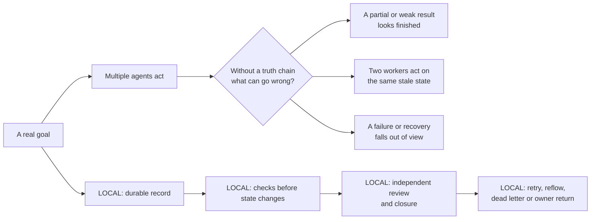
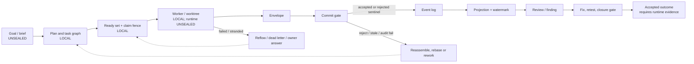
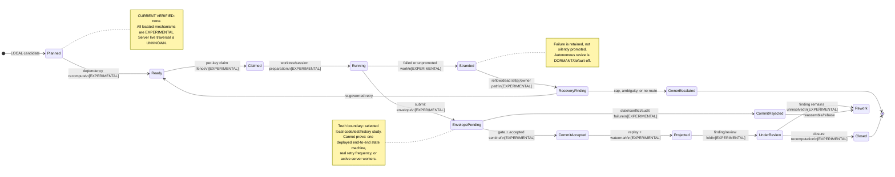
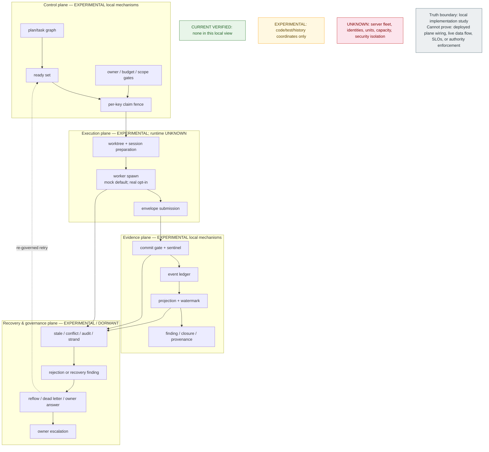
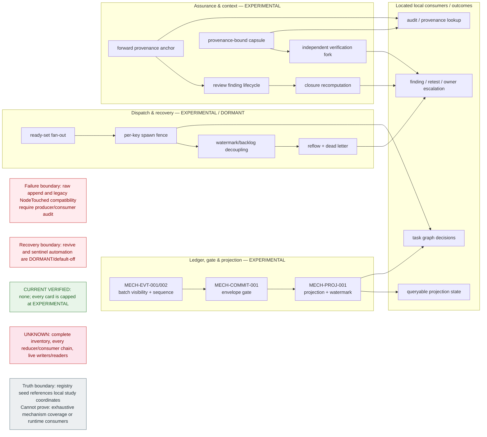

# Flowness Architecture Atlas — local evidence candidate

Scope: selected local implementation study only. Source snapshot and server
runtime are unsealed. This Atlas is therefore a set of evidence-bounded
architecture candidates, not a deployment diagram or public product claim.

Continue from D0–D5 to the included public
[`D6–D9 Atlas views`](architecture-atlas.md#d6--deployment-and-failure-domains).
The deeper private-local D6–D9 study remains outside the public package; it is
not a public dependency or registry-backed deployment, authority, provenance,
or release claim.

Notation: solid arrows are located code/event relationships; dashed arrows are
relationships that still require server evidence. `LOCAL` means code/test study,
not “running in production”. `DORMANT` and `UNKNOWN` are first-class states.

## D0 — why this exists



What this can say now: Flowness is being studied as a system for turning agent
work into a traceable, reviewable and recoverable result chain. It cannot yet
say how often this path runs, how fast it is, or which users benefit.

## D1 — candidate path from goal to accepted result



<!-- ARCH-EDGE-IDS:D1: EDGE-D1-001, EDGE-D1-002, EDGE-D1-003, EDGE-D1-004, EDGE-D1-005, EDGE-D1-006, EDGE-D1-007, EDGE-D1-008, EDGE-D1-009, EDGE-D1-010, EDGE-D1-011, EDGE-D1-012, EDGE-D1-013, EDGE-D1-014 -->

The arrows above are a candidate synthesis of the local source paths, not proof
that every goal traverses every component. In particular, dispatch, PTY owner
delivery, and deployed daemons need server evidence.

## D2 — lifecycle and failure/recovery states



<!-- ARCH-EDGE-IDS:D2: EDGE-D2-001, EDGE-D2-002, EDGE-D2-003, EDGE-D2-004, EDGE-D2-005, EDGE-D2-006, EDGE-D2-007, EDGE-D2-008, EDGE-D2-009, EDGE-D2-010, EDGE-D2-011, EDGE-D2-012, EDGE-D2-013, EDGE-D2-014, EDGE-D2-015 -->

The lifecycle joins locally located state transitions for explanatory use. It
does not establish that their event schemas, task states, daemon loops, and
owner channels form one continuously deployed state machine.

## D3 — four planes and their evidence boundary



The plane boundaries describe responsibility, not a verified deployment
topology. In particular, the execution plane is not evidence of real agent
operation because local orchestration defaults to mock spawning
(`DRIFT-PRIVATE-RUNTIME-001`, `DRIFT-RUNTIME-MOCK-001`).

## D4 — mechanism families and their local consumers



The diagram deliberately shows *located* consumers rather than a complete
consumer graph. `DRIFT-EVENT-001`, `DRIFT-STUB-BOUNDARY-001`, and
`DRIFT-PROJECTION-CONTRACT-001` prevent an “all events are fully consumed”
claim.

## D5 — candidate runtime sequence, including failure paths

```mermaid
sequenceDiagram
  participant C as Control / ready set
  participant F as Claim fence
  participant W as Worktree + worker
  participant G as Commit gate
  participant L as Event ledger
  participant P as Projection / review
  participant R as Recovery / owner

  Note over C,R: CURRENT VERIFIED: none. Located paths are EXPERIMENTAL; server runtime is UNKNOWN.
  C->>F: request per-key dispatch [EXPERIMENTAL]
  alt claim denied / stale
    F-->>C: no spawn; preserve decision
  else claim acquired
    F->>W: prepare isolated work + session [EXPERIMENTAL]
    alt worker fails or remains stranded
      W-->>R: recovery finding / dead letter [EXPERIMENTAL]
      alt governed retry available
        R-->>C: re-enter ready set
      else owner route / cap / ambiguity
        R-->>R: retain escalation; no silent promotion
      end
    else worker submits envelope
      W->>G: envelope + provenance
      alt gate accepts
        G->>L: CommitAccepted sentinel [EXPERIMENTAL]
        L->>P: replay; watermark
        alt review / closure succeeds
          P-->>C: close dependent work candidate
        else finding remains open
          P-->>R: rework / retest / owner path
        end
      else stale, conflict, audit fail, or abandonment
        G->>L: CommitRejected sentinel [EXPERIMENTAL]
        L-->>R: reassemble / rebase / recovery finding
      end
    end
  end
  Note over C,R: Truth boundary: selected local code/test/history only. Cannot prove: real Codex spawn, daemon cadence, service identity, capacity, security isolation, or end-to-end production success rate.
```

<!-- ARCH-EDGE-IDS:D5: EDGE-D5-001, EDGE-D5-002, EDGE-D5-003, EDGE-D5-004, EDGE-D5-005, EDGE-D5-006, EDGE-D5-007, EDGE-D5-008, EDGE-D5-009, EDGE-D5-010, EDGE-D5-011, EDGE-D5-012, EDGE-D5-013 -->

This sequence is intentionally a trace template, not a recording of a real
run. It must be replaced or annotated with redacted Evidence Seal traces before
any public runtime, reliability, cost, or performance statement.

## D6–D9 — boundary views, not inferred implementation

The public [Architecture Atlas](architecture-atlas.md) carries the D6–D9
deployment/fault-domain, authority/data, provenance, and release-route boundary
views. Their dashed connections name evidence that is missing, rather than
semantic arrows that the local edge registry could verify. They are **not
registry-backed deployment, authority, provenance, or release evidence** and
must not be relabeled as a topology, RBAC model, live trace, or approval
decision.

## D2–D9 build sheet

| View | What is safe to draw now | Must stay visible as unknown or draft |
| --- | --- | --- |
| D2 lifecycle | event batch, envelope, task, finding and dead-letter state machines | unified live end-to-end state machine; autonomous revive is dormant |
| D3 planes | control, execution, evidence, recovery/governance responsibilities | server fleet/security as a verified plane |
| D4 mechanism families | ledger/gate/projection, dispatch/recovery, assurance, provenance and their local consumers | completeness of inventory and raw-port coverage |
| D5 sequences | commit→sentinel→projection; ready→claim→worktree; backlog→re-governed retry; stranded→reflow | live intervals, SLOs, service identities and capacity |
| D6 deployment | logical failure-domain template only; see D6 boundary view | hostnames, units, enabled timers, active workers and rollback topology |
| D7 authority/data | write paths, owner gates, session claims, capsule and raw-port boundary; see D7 boundary view | secret isolation, network policy, sandbox enforcement, all-write coverage |
| D8 provenance | event/envelope/sentinel/watermark/capsule/finding/forward-anchor graph; see D8 boundary view | a live trace proving all artifacts and public claims resolve |
| D9 roadmap | local implementation, dormant/experimental, designed targets and known Unknown/Drift lanes; see D9 boundary view | Alpha/Beta/full release recommendation before evidence, install and jury gates |

## Required boundary labels on every rendered view

`scope: local implementation study` · `source snapshot: pending Evidence Seal`
· `runtime: unsealed` · `coverage: selected cards, not complete inventory` ·
`does not prove: deployment, performance, adoption, or all-path coverage`.

## Known visual obligations

- Draw Path-B as individually durable but not batch atomic.
- Draw per-key claim fencing, not universal single-flight serialization.
- Draw watermark/backlog as idempotent replay protocol, not cross-file exactly-once.
- Draw default-off/dormant recovery distinctly from working recovery paths.
- Draw reflow as emitting a recovery finding, not silently promoting main.
- Draw raw append as a weaker, audited boundary.
