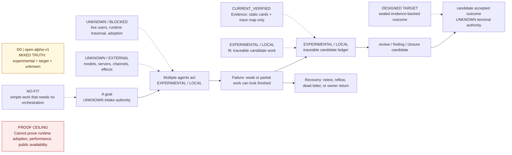
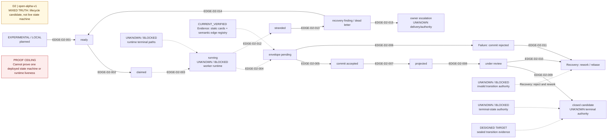
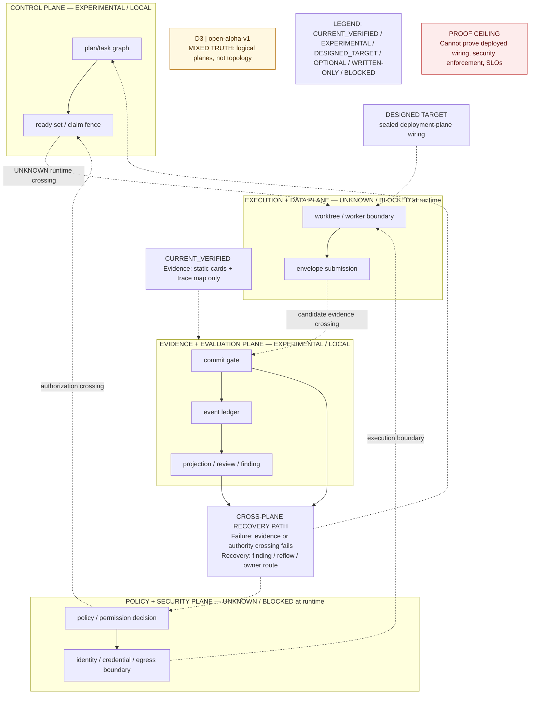
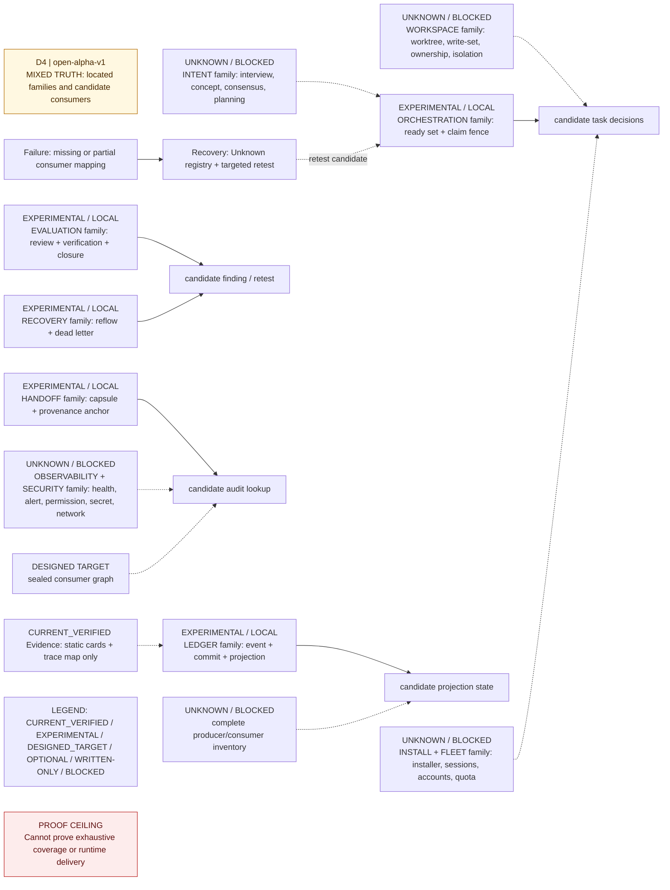
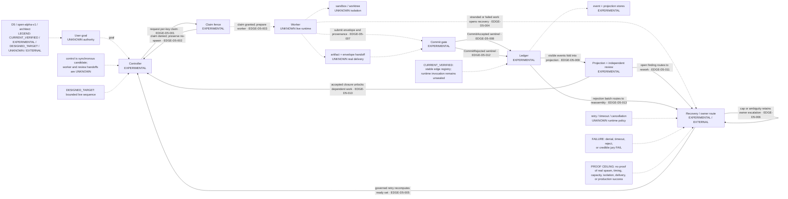
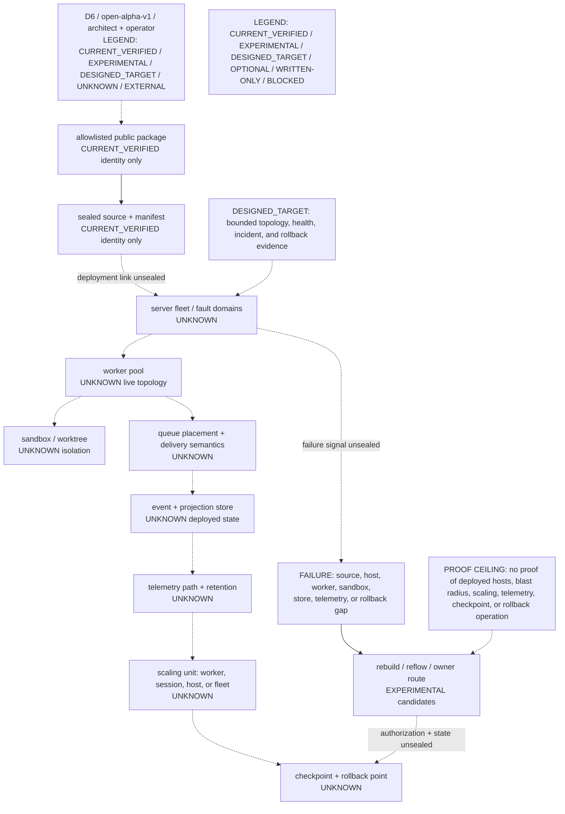
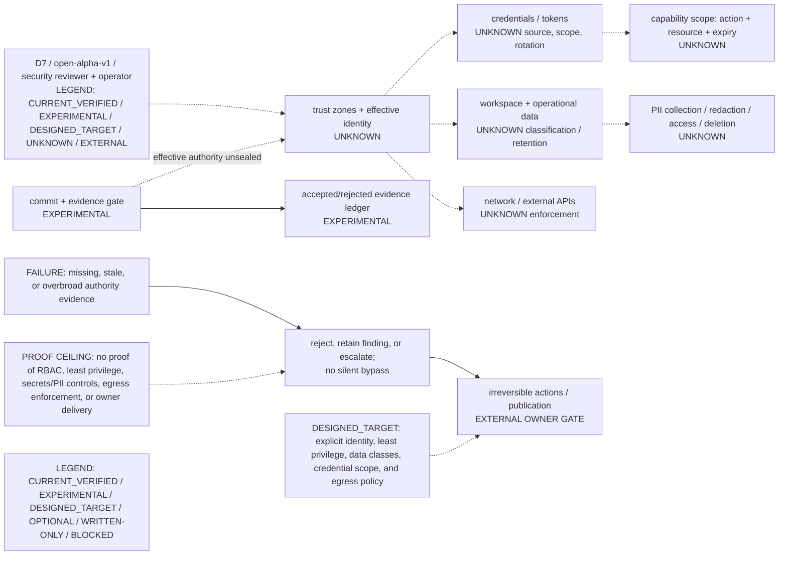
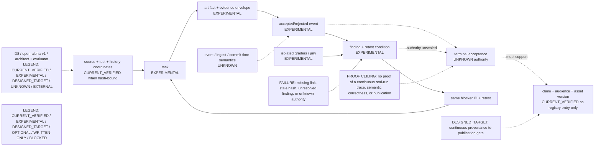
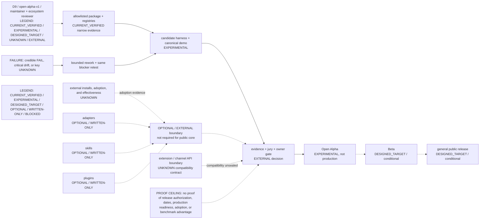

<!-- SPDX-License-Identifier: CC-BY-4.0 -->

# D0-D9 Architecture Atlas

The Atlas is a linked set of evidence views, not a single decorative poster.
Every view uses stable mechanism, module, event, task, artifact, and gate IDs
from accepted registries.

This page is the public Open Alpha Atlas index and view contract. It is a
mixed-truth map: runnable and tested Alpha surfaces remain `experimental`,
future relationships remain `designed_target`, and missing runtime evidence
remains `unknown` or `blocked`. A diagram is explanatory evidence only; it does
not promote an experimental or target node to production-proven behavior.

Exact source, package, clean-room, and jury identities live in the external
release record. The view contracts below define what each D0–D9 rendering must
show and what it cannot prove; legacy local render studies are not the public
Atlas entry point.

Common machine truth sources are the [Atlas contract](../config/architecture-atlas.json),
[Mechanism Registry](../registries/mechanism-cards-v0.json),
[semantic Edge Registry](../registries/architecture-cross-layer-edges-local-v0.json),
and [Open Alpha Claim/launch registry](../registries/open-alpha-discovery-launch-pack-v0.json).
Every editable Mermaid source and its locally rendered, versioned SVG are linked
below; Git history binds each pair to the same release commit.

| View | Previous | Editable source | Rendered SVG | Next |
| --- | --- | --- | --- | --- |
| D0 | — | [D0.mmd](../assets/architecture-atlas/open-alpha-v1/D0.mmd) | [D0.svg](../assets/architecture-atlas/open-alpha-v1/D0.svg) | [D1](#d1--goal-to-accepted-outcome) |
| D1 | [D0](#d0--why-flowness-exists) | [D1.mmd](../assets/architecture-atlas/open-alpha-v1/D1.mmd) | [D1.svg](../assets/architecture-atlas/open-alpha-v1/D1.svg) | [D2](#d2--lifecycle-state-machine) |
| D2 | [D1](#d1--goal-to-accepted-outcome) | [D2.mmd](../assets/architecture-atlas/open-alpha-v1/D2.mmd) | [D2.svg](../assets/architecture-atlas/open-alpha-v1/D2.svg) | [D3](#d3--four-responsibility-planes) |
| D3 | [D2](#d2--lifecycle-state-machine) | [D3.mmd](../assets/architecture-atlas/open-alpha-v1/D3.mmd) | [D3.svg](../assets/architecture-atlas/open-alpha-v1/D3.svg) | [D4](#d4--mechanism-families-and-consumers) |
| D4 | [D3](#d3--four-responsibility-planes) | [D4.mmd](../assets/architecture-atlas/open-alpha-v1/D4.mmd) | [D4.svg](../assets/architecture-atlas/open-alpha-v1/D4.svg) | [D5](#d5--candidate-runtime-sequence) |
| D5 | [D4](#d4--mechanism-families-and-consumers) | [D5.mmd](../assets/architecture-atlas/open-alpha-v1/D5.mmd) | [D5.svg](../assets/architecture-atlas/open-alpha-v1/D5.svg) | [D6](#d6--deployment-and-failure-domains) |
| D6 | [D5](#d5--candidate-runtime-sequence) | [D6.mmd](../assets/architecture-atlas/open-alpha-v1/D6.mmd) | [D6.svg](../assets/architecture-atlas/open-alpha-v1/D6.svg) | [D7](#d7--authority-data-and-credentials) |
| D7 | [D6](#d6--deployment-and-failure-domains) | [D7.mmd](../assets/architecture-atlas/open-alpha-v1/D7.mmd) | [D7.svg](../assets/architecture-atlas/open-alpha-v1/D7.svg) | [D8](#d8--evidence-and-claim-provenance) |
| D8 | [D7](#d7--authority-data-and-credentials) | [D8.mmd](../assets/architecture-atlas/open-alpha-v1/D8.mmd) | [D8.svg](../assets/architecture-atlas/open-alpha-v1/D8.svg) | [D9](#d9--maturity-and-extension-boundary) |
| D9 | [D8](#d8--evidence-and-claim-provenance) | [D9.mmd](../assets/architecture-atlas/open-alpha-v1/D9.mmd) | [D9.svg](../assets/architecture-atlas/open-alpha-v1/D9.svg) | — |

## Views

| ID | Audience and question | Required content | Acceptance | Does not prove |
| --- | --- | --- | --- | --- |
| D0 | Public: why does Flowness exist? | Actors, failure scenario, input, verified outcome, external systems, fit and no-fit | A new reader can state the problem and outcome in 30 seconds | Implementation or performance |
| D1 | Public/developer: how does a goal become an accepted outcome? | Goal, plan, execution, finding, correction, acceptance, publish boundary; redo/cancel/fail/resume | Reader identifies the authoritative outcome and one return loop | That every transition is implemented |
| D2 | Developer: what are the lifecycle states? | State machine, terminal/nonterminal states, invalid transitions, owner gates, truth source | Every state maps to a schema/event and invalid paths are visible | Runtime liveness |
| D3 | Developer: where are system responsibilities? | Control, execution/data, policy/security, evidence/evaluation planes and crossings | Each component has owner, interface, source, and current/target status | Deployment topology |
| D4 | Developer: which mechanism families serve which consumers? | Intent, task graph, event/projection, workspace, review, handoff, recovery, install/fleet, observability/security | Any consumer can be traced back to producer and authoritative state | End-to-end success |
| D5 | Architect: what happens at runtime? | User, orchestrator, worker, sandbox, judge, stores; sync/async calls; artifact handoffs; retry/timeout | Any arrow traces to interface, event, state, or artifact ID | Capacity or failure isolation |
| D6 | Architect/operator: where does it run and fail? | Server, workers, sandboxes, queues, stores, telemetry, scaling units, failure domains, checkpoint and rollback | Operator locates blast radius, recovery owner, and rollback point | Security authorization |
| D7 | Security/operator: who may see or change what? | Trust zones, code/data/PII/credentials, egress, capability scopes, owner approval | Reviewer locates every credential crossing and irreversible action | License or provenance completeness |
| D8 | Architect/evaluator: how is truth derived? | Event/task/artifact/finding/acceptance lineage, source hashes, timestamps, graders, claim links | Public claim traces to accepted outcome and raw evidence | Semantic correctness without evaluation |
| D9 | Maintainer/ecosystem: what is current, target, optional, or external? | Current verified core, experimental modules, designed target, adapters/skills/plugins, API/version boundaries | No candidate or future element can be mistaken for current capability | Delivery date or roadmap commitment |

## Rendered progressive views

These are the canonical, editable public views for Open Alpha. Read them in
order. Status is part of every node, not an implication from its position:
`CURRENT_VERIFIED` means only the narrow evidence named in that view;
`EXPERIMENTAL` means runnable or statically located Alpha work with a limited
claim; `DESIGNED_TARGET` is an intended relationship, not shipped behavior;
`UNKNOWN` is missing evidence; and `EXTERNAL` is outside the public core or
requires an owner decision. Solid arrows show located relationships. Dashed
arrows show target or unsealed relationships.

### D0 — why Flowness exists

**Version/date:** `open-alpha-v1`, 2026-08-02 · **Audience:** public ·
**Scope:** the coordination problem and intended value, not implementation.

**Truth sources:** `MECH-REVIEW-001`, `MECH-VERIFY-001`, the Claim Registry,
and the public package tests. **Authoritative state / owner:** the registries
are authoritative only for package claims; a human owner retains external
publication authority. **Failure/recovery:** weak or conflicting evidence
becomes a finding and returns to rework. **Proof ceiling:** this view cannot
prove implementation completeness, live operation, performance, or adoption.
Continue to D1 for the intended lifecycle.

### D1 — goal to accepted outcome

**Version/date:** `open-alpha-v1`, 2026-08-02 · **Audience:** public and
developer · **Scope:** mixed-status lifecycle; not a recorded end-to-end run.

```mermaid
flowchart LR
  H["D1 | open-alpha-v1\nMIXED TRUTH: candidate path, not live proof"]:::status
  goal["goal / brief\nUNKNOWN / BLOCKED"] -.->|goal becomes plan candidate · EDGE-D1-001| plan["plan + task graph\nEXPERIMENTAL / LOCAL"]
  plan -->|ready work becomes claimable · EDGE-D1-002| dispatch["ready set + claim fence\nEXPERIMENTAL / LOCAL"]
  dispatch -.->|claim prepares worker · EDGE-D1-003| worker["worker / worktree\nUNKNOWN / BLOCKED"]
  worker -.->|worker submits result envelope · EDGE-D1-004| envelope["result envelope\nUNKNOWN / BLOCKED"]
  envelope -->|validate envelope · EDGE-D1-005| gate["commit gate\nEXPERIMENTAL / LOCAL"]
  gate -->|accepted sentinel enters ledger · EDGE-D1-006| eventlog["event ledger\nEXPERIMENTAL / LOCAL"]
  eventlog -->|visible batch advances projection · EDGE-D1-007| projection["projection + watermark\nEXPERIMENTAL / LOCAL"]
  projection -->|projected result enters review · EDGE-D1-008| review["review / finding\nEXPERIMENTAL / LOCAL"]
  review -->|finding triggers fix and retest · EDGE-D1-009| closure["fix / retest / closure\nEXPERIMENTAL / LOCAL"]
  closure -.->|closure proposes accepted outcome · EDGE-D1-010| accepted["candidate accepted outcome\nUNKNOWN / BLOCKED"]
  gate -->|rejection returns to rework · EDGE-D1-011| rework["Failure: stale / conflict / audit fail\nRecovery: reassemble / rebase"]
  worker -.->|stranded work opens recovery · EDGE-D1-012| recovery["Failure: stranded work\nRecovery: reflow / dead letter / owner route"]
  recovery -.->|governed resume recomputes ready set · EDGE-D1-013| dispatch
  rework -.->|redo revises plan · EDGE-D1-014| plan
  worker -.->|cancel request reaches authority boundary · EDGE-D1-015| Cancel["UNKNOWN / BLOCKED\ncancel requested; authority unsealed"]
  Cancel -.->|resume requires governed re-entry · EDGE-D1-016| Resume["UNKNOWN / BLOCKED\nresume authorization unsealed"]
  Resume -.->|authorized resume recomputes ready set · EDGE-D1-017| dispatch
  accepted -.->|accepted is not published without owner gate · EDGE-D1-018| PublishBoundary["UNKNOWN / OWNER GATE\npublish / external-effect authorization"]
  PublishBoundary -.->|DESIGNED TARGET only: authorized release · EDGE-D1-019| Published["DESIGNED TARGET\npublished external effect"]
  Target["DESIGNED TARGET\nsealed end-to-end acceptance"] -.-> accepted
  Evidence["CURRENT_VERIFIED Evidence: static cards + semantic edge registry"] -.-> gate
  Legend["LEGEND: CURRENT_VERIFIED / EXPERIMENTAL / DESIGNED_TARGET / OPTIONAL / WRITTEN-ONLY / BLOCKED"]
  Ceiling["PROOF CEILING\nCannot prove every goal traverses a running service"]:::boundary
  classDef status fill:#fff8e1,stroke:#b26a00,color:#4a2900;
  classDef boundary fill:#fdecec,stroke:#b91c1c,color:#5f1111;

%% ARCH-EDGE-IDS:D1: EDGE-D1-001, EDGE-D1-002, EDGE-D1-003, EDGE-D1-004, EDGE-D1-005, EDGE-D1-006, EDGE-D1-007, EDGE-D1-008, EDGE-D1-009, EDGE-D1-010, EDGE-D1-011, EDGE-D1-012, EDGE-D1-013, EDGE-D1-014, EDGE-D1-015, EDGE-D1-016, EDGE-D1-017, EDGE-D1-018, EDGE-D1-019
```

**Truth sources:** `M-ORCH-READYSET-EVENT-FANOUT`, `MECH-COMMIT-001`,
`MECH-REVIEW-001`, and `MECH-CLOSURE-001`. **Authoritative state / owner:**
the event ledger is the located state candidate; terminal acceptance and
publication remain owner-controlled and unsealed. **Failure/recovery:** worker,
gate, or review failures retain a finding and re-enter bounded planning.
**Proof ceiling:** this view cannot prove every transition is implemented, live
or complete, nor that an outcome was accepted or published. Continue to D2.

### D2 — lifecycle state machine

**Version/date:** `open-alpha-v1`, 2026-08-02 · **Audience:** developer ·
**Scope:** located event/gate/projection states plus explicit gaps.

**Truth sources:** `MECH-EVT-001/002`, `MECH-COMMIT-001`, and
`MECH-PROJ-001`. **Authoritative state / owner:** accepted ledger records are
the located replay source; effective terminal authority remains Unknown.
**Failure/recovery:** reject, stranded, and invalid candidates route to rework
or explicit escalation, never silent promotion. **Proof ceiling:** this view
cannot prove runtime liveness, an exhaustive transition inventory, or that
`Closed` is correctly authorized. D3 separates responsibilities.

### D3 — four responsibility planes

**Version/date:** `open-alpha-v1`, 2026-08-02 · **Audience:** developer ·
**Scope:** logical responsibility boundaries, not deployment topology.

**Truth sources:** ready-set, commit, event, projection, and review mechanism
cards. **Authoritative state / owner:** the ledger is the located evidence
state; plane owners and effective service identities remain Unknown.
**Failure/recovery:** a failed crossing is retained as rejection, finding, or
owner escalation. **Proof ceiling:** this view cannot prove a deployment,
running worker, effective identity, security control, or service level. D4
shows the located mechanism-to-consumer relationships.

### D4 — mechanism families and consumers

**Version/date:** `open-alpha-v1`, 2026-08-02 · **Audience:** developer ·
**Scope:** located families and consumers, not an exhaustive inventory.

**Truth sources:** the Mechanism, Unknown, and Drift registries, especially
`MECH-EVT-001`, `MECH-PROJ-001`, `MECH-REVIEW-001`, and
`M-REFLOW-OUT-OF-BAND-RECONCILIATION`. **Authoritative state / owner:** the
event/projection pair is the state candidate; unmapped consumers remain
Unknown. **Failure/recovery:** missing or stale consumer chains become drift or
findings and return through reflow/retest. **Proof ceiling:** this view cannot
prove exhaustive coverage, live consumers, or end-to-end success. D5 traces a
single candidate runtime sequence.

### D5 — candidate runtime sequence

**Version/date:** `open-alpha-v1`, 2026-08-02 · **Audience:** architect ·
**Scope:** trace template; not a captured production run.

**Truth sources:** claim fencing, commit gate, ledger/projection, review, and
recovery mechanism cards. **Authoritative state / owner:** accepted ledger
records support replay; the owner alone authorizes external publication.
**Failure/recovery:** denial, timeout, reject, and jury failure all retain an
inspectable route to rework. **Proof ceiling:** this template cannot prove real
spawning, timing, capacity, isolation, owner delivery, or production success.
D6 makes the missing deployment facts visible.

### D6 — deployment and failure domains

**Version/date:** `open-alpha-v1`, 2026-08-02 · **Audience:** architect and
operator · **Scope:** known package boundary plus unsealed runtime topology.

**Truth sources:** sealed export manifest and clean-room receipt when present,
plus `MECH-COMMIT-001`, `MECH-PROJ-001`, and recovery mechanism cards.
**Authoritative state / owner:** package identity may be verified; deployed
revision, unit state, checkpoint, and recovery owner remain Unknown.
**Failure/recovery:** candidate rebuild, reflow, and owner routes are shown
without claiming that a daemon invokes them. **Proof ceiling:** this view cannot
prove deployed hosts, blast radius, scaling, telemetry, checkpoints, rollback,
or recovery liveness. D7 narrows the trust boundary.

### D7 — authority, data, and credentials

**Version/date:** `open-alpha-v1`, 2026-08-02 · **Audience:** security reviewer
and operator · **Scope:** claim and code boundaries, not a verified RBAC model.

**Truth sources:** public scope policy, rights/license audit, commit and owner
mechanism cards, and the Unknown/Drift registries. **Authoritative state /
owner:** the allowlist governs public package content; effective identities,
entitlements, data classes, and credential scope remain Unknown; the owner
retains irreversible-action authority. **Failure/recovery:** absent authority
evidence produces rejection or escalation. **Proof ceiling:** this view cannot
prove RBAC, least privilege, secrets/PII handling, retention, egress
enforcement, sandbox isolation, or owner-delivery correctness. D8 traces what
evidence would be required.

### D8 — evidence and claim provenance

**Version/date:** `open-alpha-v1`, 2026-08-02 · **Audience:** architect and
evaluator · **Scope:** located provenance chain with explicit unsealed links.

**Truth sources:** the registries, source hashes, event/projection cards,
finding/retest records, and Content Graph. **Authoritative state / owner:**
hash-bound registry records prove only their own entries; acceptance authority
and channel state remain separately owner-controlled. **Failure/recovery:** any
missing link, stale hash, or open finding blocks dependent claims and reuses the
same blocker ID through retest. **Proof ceiling:** this view cannot prove a
continuous real-run trace, complete producer/consumer coverage, semantic
correctness without evaluation, or publication. D9 separates what exists from
what remains conditional.

### D9 — maturity and extension boundary

**Version/date:** `open-alpha-v1`, 2026-08-02 · **Audience:** maintainer and
ecosystem reviewer · **Scope:** status separation, not a roadmap commitment.

**Truth sources:** public package manifests, Mechanism/Claim/Drift registries,
the readiness ledger, clean-room evidence, and isolated jury records.
**Authoritative state / owner:** each named artifact is authoritative only for
its own narrow status; repository and channel mutations remain owner-gated.
**Failure/recovery:** a credible `FAIL`, critical drift, or key `UNKNOWN`
reopens bounded work without averaging away the blocker. **Proof ceiling:**
this view cannot prove release authorization, delivery dates, production
readiness, external adoption, benchmark advantage, or publication.

## Required notation

Every diagram must include:

- diagram ID, version, date, audience, and scope boundary;
- stable component IDs matching code, schema, and registry records;
- a legend for current verified, experimental, designed target, optional,
  external, written-only, unknown, and blocked;
- control versus data flow and synchronous versus asynchronous edges;
- authoritative state, ownership, failure path, recovery or rollback;
- links to truth sources and the previous/next Atlas view; and
- a visible “does not prove” statement.

Mermaid or another text source is canonical; SVG/PNG is a rendering. Both are
versioned. A screenshot without editable source is not an accepted Atlas
artifact.

## Progression

Use the sequence `D0 → D1 → D2/D3/D4 → D5 → D6/D7 → D8 → D9`.
Public material normally begins with D0 and D1. Engineering documentation links
into D2-D8. Extension and roadmap material begins at D9 and links backward to
the boundaries it depends on.

Atlas acceptance needs two architecture judges. One checks coverage and stable
identity; the other traces arrows and looks for mixed current/target claims.
