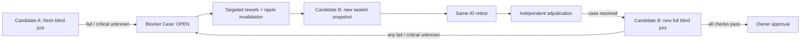

<!-- SPDX-License-Identifier: CC-BY-4.0 -->

# Jury rework closure — v0

Status: **experimental Open Alpha mechanism**. It originated in private
staging and now exposes immutable `Blocker Case` and `Rework Manifest` records
that bind the failed check, successor snapshot, and exhaustive ripple
invalidations. `jury-bundle/v1` seals candidate, policy, reports, and an
optional full A→B retest lineage. Bundle-only evaluation consumes only its
verified copies and binds its ID/hash into the decision. The deterministic
Open Alpha demo closes one bounded fixture case; this is not proof of a
general production closure system or a model-run whole-jury outcome.

## Rule

A trusted `fail`, or a critical `unknown`, opens an immutable Blocker Case. It
cannot be averaged away, manually removed, or cleared inside the candidate that
failed. The original candidate remains blocked forever; only a successor
candidate may demonstrate a bounded repair and earn a fresh first-pass jury.

## Required records

`Blocker Case` is an immutable record with the original candidate/snapshot,
report and check, blocker ID, reproduction contract, evidence IDs, affected
claims/assets, first verdict and retest condition.

`Rework Manifest` is a successor-only record with that same blocker ID, prior
case reference, bounded change and ripple evidence, invalidated artifacts, new
candidate hash and retest condition. A new task ID is allowed; a renamed or
new blocker ID is not.

`Jury Bundle` is a local immutable evidence bundle. It binds candidate/policy
bytes, report hashes and an optional A→B lineage. It is
`jury_evidence_only`; bundle-only evaluation consumes a verified bundle rather
than arbitrary report paths, but never deploys or publishes.

## Separation and retest rules

- Retest is against the successor snapshot, preserves the original check/gate/
  dimension/reproduction contract, and uses the same blocker ID.
- The retest judge differs from both original first-pass judges, candidate
  author and adjudicator; the adjudicator differs from all of them.
- Adjudication may resolve a Blocker Case but cannot authorize release.
- Resolution invalidates only the named blocker; Candidate B still requires a
  complete new blind jury across every required dimension.
- Critical `unknown` retains the report's blocker ID and records missing
  evidence/acquisition work; it is never replaced with a synthetic ID.

## Current implementation gap

Current release aggregation blocks trusted fails and critical unknowns. The
experimental Open Alpha code, first developed during private staging, creates
and verifies immutable Blocker Cases, Rework
Manifests, and a narrow `successor-retest-attestation/v1`. The latter binds a
specific Case and Manifest to B's new candidate/snapshot plus at least two
fresh, independent first-pass reports for the original check; a critical
unknown additionally requires a complete mapping from each missing item to B
evidence. Same-candidate retest is forbidden from clearing A.

This remains deliberately narrower than general release closure: the
experimental bundle does not by itself attest a controller-run, model-judge
whole-jury identity set. The attestation records `rework_retested` evidence
only. It cannot clear A, authorize B, or substitute for B's exact full blind
jury and owner gate outside the bounded deterministic demo.
