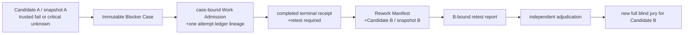

<!-- SPDX-License-Identifier: CC-BY-4.0 -->

# Successor retest lineage — v0

Status: **experimental Open Alpha lineage contract**. It originated as a P1
private-staging mechanism. Bundle-only evaluation and a bounded deterministic
demo outcome are available; no model-run whole-jury or production-runtime
claim follows. The contract prevents a failed Candidate A from being
“cleared” by an unrelated task, a renamed blocker, or a report that only looks
like a retest.

## The only allowable closure route

No arrow authorizes release. Candidate B can proceed only after its own full
blind jury and owner gate. Candidate A stays blocked forever.

## Required machine bindings

The eventual `rework_binding` on a Work Admission Card must contain the exact
Blocker Case ID/hash/artifact, original candidate/snapshot/report/check and
blocker ID. Its artifact must also appear in immutable inputs, and its current
gate must name the same blocker. A later work attempt must therefore inherit
the Case rather than creating a semantically equivalent fresh task ID.

The terminal receipt is usable by a Rework Manifest only if it is `completed`,
has a non-empty execution artifact, and carries `retest_required: true`. The
manifest binds that receipt to Candidate B's new snapshot; it must not be
written back into Candidate B, which would create a candidate-hash cycle.

Candidate B's retest report must name the same case/manifest/hash/original
check and successor snapshot. A clearing adjudicator must differ from the
original judges, Candidate B author and retest judge. The evaluator must retain
the original blocker ID and expose the resolution as audit information, not
delete history.

## Known implementation gaps

- Work Admission Cards now bind the immutable Case artifact and original
  blocker identity; their terminal receipts must require a retest.
- Release aggregation preserves a critical unknown's declared blocker ID, and
  Blocker Case v2 preserves unknown-specific missing-evidence acquisition
  work.
- Same-candidate retest is explicitly rejected as a blocker-clearing route.
  Bundle-only evaluation consumes a sealed Candidate B lineage, but it cannot
  legally close Candidate A → Candidate B without a real whole-jury outcome
  and owner gate.
- The public experimental implementation, first exercised in private staging,
  emits a `successor-retest-attestation/v1`: it binds a
  v2 Blocker Case, v2 Rework Manifest, B's candidate/snapshot and at least two
  fresh independent first-pass reports for the original check. It is targeted
  evidence only, not a Jury Bundle, a clearance, or a release authorization.
- `jury-bundle/v1` seals successor inputs and verifies them fail-closed;
  bundle-only evaluation consumes only its verified copies. This does not
  establish a model-run whole-jury result. Owner release authorization is a
  separate external authority and does not validate an arbitrary bundle.

Within the deterministic demo, a Case and Manifest can clear only their
bounded fixture blocker through the defined successor route. An actual release
blocker remains open until the exact successor, independent retest/jury
evidence, and owner-controlled release decision satisfy its recorded
condition.
