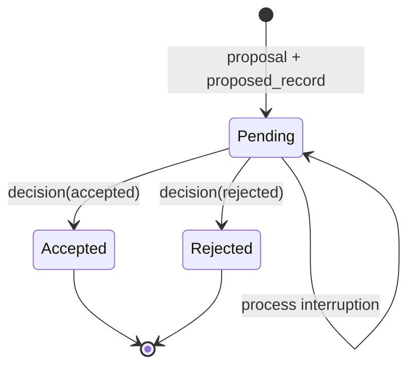

# Flowness Ledger Core candidate: decision-gated visibility

Status: public Open Alpha technical note. It documents the current local
proposal-ledger slice, not the whole Flowness platform or a production runtime.

## Failure being addressed

In a multi-step change, writing evidence before deciding whether to accept it
creates a dangerous ambiguity: a reader can observe a partially assembled
change and treat it as committed. The candidate separates durability from
committed visibility.

## State model

The audit reader sees all immutable records. The committed reader exposes only
`proposed_record` entries belonging to an `accepted` proposal. Rejected and
undecided proposals remain durable but invisible to that reader.

## Integrity and recovery boundary

Each JSONL record carries its sequence and previous-record hash. Readers fail
closed for a malformed complete line, a duplicate ID, a sequence regression or
a broken hash link. A final unterminated JSONL tail is treated separately: the
reader refuses to continue until `recover()` truncates only that incomplete
tail. Recovery never invents acceptance, rejection or a missing middle record.
When requested with `persist_report=True`, recovery writes an immutable,
self-hashed receipt under `recovery-reports/`. The receipt binds the resulting
ledger-head sequence/hash plus pending and committed summaries. A verifier can
check that receipt against the named immutable ledger prefix after later appends.

## Evidence available now

The package tests proposal visibility, rejection/conflict behavior and final
tail recovery. The `change-evidence-demo` additionally writes a self-hashed
run manifest and persisted recovery receipt covering the same positive and
negative cases. `--verify-demo-dir` independently checks those artifacts; a
tampered receipt is a tested negative fixture. A local Python 3.12
new-environment wheel install has exercised the demo. A non-author clean-room
run of the exact sealed export and its fresh jury decision remain required
before release; this note does not claim that external acceptance.

## What this note cannot establish

This note alone does not establish distributed consensus, exactly-once
delivery, performance, cross-platform support, production reliability,
external adoption, or the wider platform's runtime behavior. Those boundaries
remain tracked in the README, compatibility note and OSS Drift Atlas.
