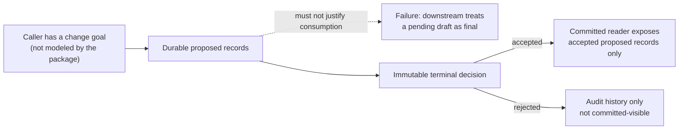
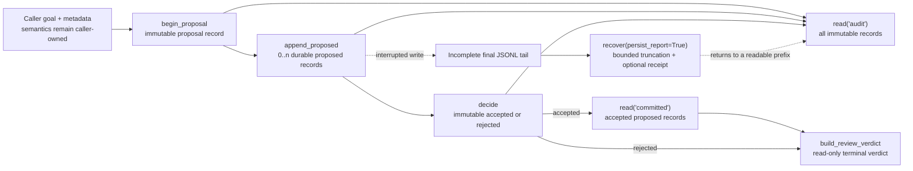
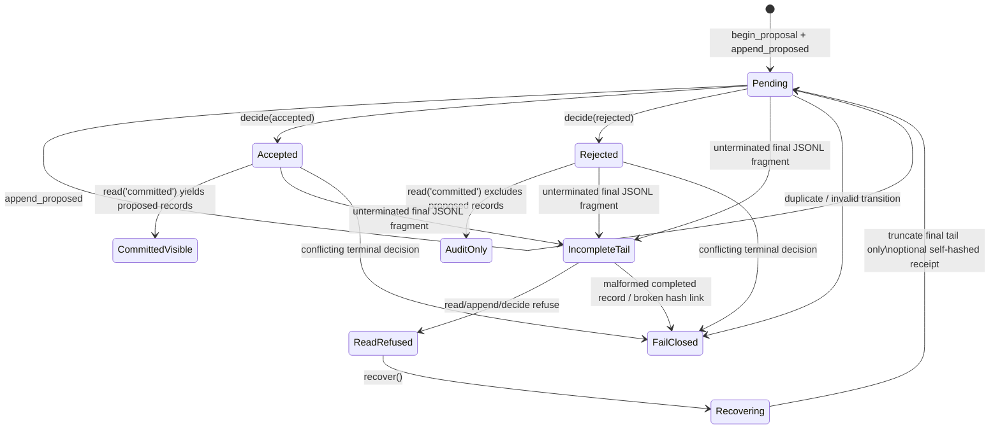

# Flowness Ledger Core candidate — D0–D2 architecture views

Status: **public Open Alpha / local static-and-test evidence**. These
three views describe only `flowness-ledger-core`, not the wider Flowness
platform. They are not a runtime topology, a broad compatibility promise, or
evidence of an operating multi-agent system.

Read them in order. D0 explains the failure the candidate tries to prevent;
D1 shows the deliberately small local contract; D2 shows the candidate state,
failure, and bounded recovery paths. A **caller** supplies the business goal
and payload semantics: this package does not model, authorize, or verify that
goal.

## D0 — why a durable draft must not look like a decision

**Status:** `current Open Alpha local slice`. The evidence supports the package's
local committed-view rule, not a claim about a live Flowness deployment.

### Evidence pointers

- The problem and contract are stated in the [technical report D0–D1](LEDGER_CANDIDATE_TECHNICAL_REPORT.md#d0--the-human-problem).
- `Ledger.read("committed")` derives visibility from an accepted terminal
  decision in [`ledger.py:222-232`](../src/flowness_ledger_core/ledger.py#L222-L232).
- [Case 1](LEDGER_CANDIDATE_CASEBOOK.md#case-1--an-accepted-change-becomes-visible-as-one-committed-result)
  and [`test_ledger.py:12-21`](../tests/test_ledger.py#L12-L21) exercise
  pending invisibility followed by accepted visibility.

### Cannot prove

This view cannot prove that a real consumer consults this reader before acting,
that a caller's goal is correct, that a decision-maker is authorized, or that
an external workflow is atomic. It does not model agent planning, delegation,
business rollback, distributed ordering, or runtime availability.

## D1 — the local proposal-to-verdict path

**Status:** `current Open Alpha local slice`. “Goal” is a diagram input name, not a
stored goal entity or an implementation claim; the concrete API begins at
`begin_proposal`.

### Evidence pointers

- Proposal creation, proposed-record append, terminal decision, and committed
  read are implemented at [`ledger.py:179-232`](../src/flowness_ledger_core/ledger.py#L179-L232).
- The terminal review adapter reads existing immutable state and refuses a
  pending proposal at [`review.py:13-41`](../src/flowness_ledger_core/review.py#L13-L41).
- The executable demo exercises accepted, rejected, conflict, interrupted-tail
  and recovery paths at [`demo.py:54-141`](../src/flowness_ledger_core/demo.py#L54-L141).
- The three evidence-bounded paths are expanded in the
  [candidate casebook](LEDGER_CANDIDATE_CASEBOOK.md).

### Cannot prove

This path cannot prove that a review verdict is an approval, that an optional
recovery receipt has been exported or independently audited, or that the
caller, reviewer, and consumer are different authorized actors. It does not
provide an agent runtime, task graph, server, queue, network protocol, or
cross-process workflow orchestration.

## D2 — candidate states, failures, and recovery limits

**Status:** `current Open Alpha local slice`. This is a state interpretation of
local file-backed API behavior, not a live service state machine. `Pending`
after recovery means the preserved prefix may still contain a pending proposal;
it does not assert that every recovered prefix has that shape.

### Evidence pointers

- Immutable record/hash validation and incomplete-final-tail detection are in
  [`ledger.py:91-119`](../src/flowness_ledger_core/ledger.py#L91-L119); proposal
  transition validation is in [`ledger.py:121-151`](../src/flowness_ledger_core/ledger.py#L121-L151).
- Terminal-decision conflict refusal is implemented at
  [`ledger.py:205-220`](../src/flowness_ledger_core/ledger.py#L205-L220).
- `recover()` truncates only an incomplete final tail and can persist a
  self-hashed receipt at [`ledger.py:350-379`](../src/flowness_ledger_core/ledger.py#L350-L379).
- [`test_ledger.py:24-69`](../tests/test_ledger.py#L24-L69) covers conflict
  refusal, bounded tail recovery, and receipt-tamper refusal; Cases 2–3 give
  their observable local evidence and limits.

### Cannot prove

This state view cannot prove crash consistency on every filesystem, NFS or
Windows correctness, repair of arbitrary corruption, distributed recovery,
leader election, exactly-once delivery, incident response, or a production
rollback. It also cannot prove that recovery should occur automatically: the
candidate exposes a local operation, not an autonomous runtime policy.

## How these views remain honest

Each figure uses the same evidence ceiling: source and local tests show a
bounded Open Alpha behavior; they do not promote it to Beta or production. Any
change to the cited code, tests, casebook, or technical report requires a
review of this document. The open-source readiness requirements remain in the
[technical report's route](LEDGER_CANDIDATE_TECHNICAL_REPORT.md#open-source-route)
and the parent OSS Harness registry; they are intentionally outside these
three diagrams.
