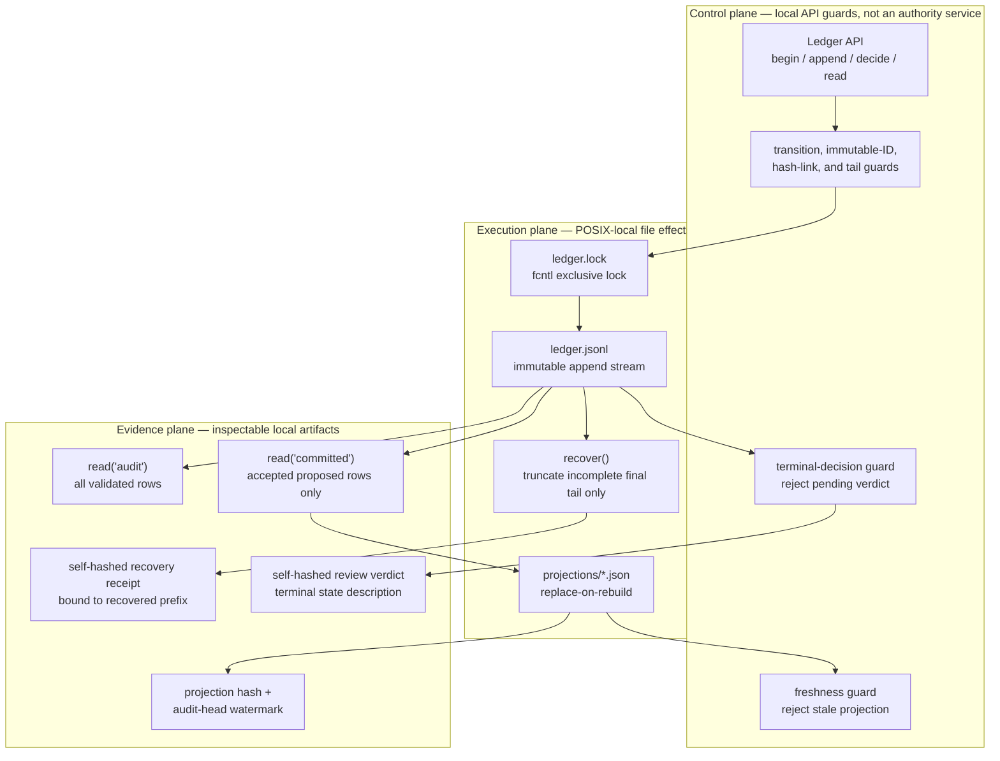
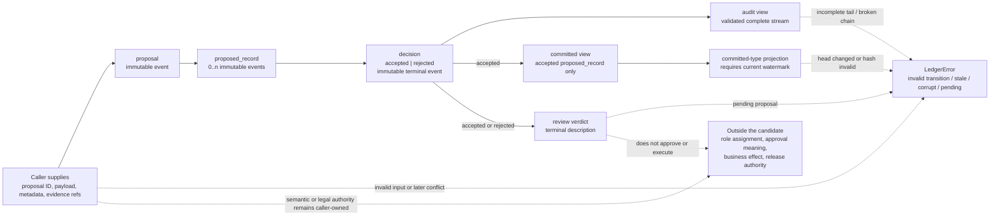

# Flowness Ledger Core candidate — D3–D5 architecture views

Status: **public Open Alpha / local static-and-test evidence**. These
views continue the [D0–D2 architecture views](LEDGER_CANDIDATE_ARCHITECTURE_D0_D2.md).
They explain only the local `flowness-ledger-core` candidate. They do not turn the package into a deployment, an RBAC system, a production runtime, or a claim about wider Flowness orchestration.

The diagrams deliberately use **caller** rather than “agent”, “reviewer”, or
“operator” where the code accepts an ordinary local API call. Naming a role in
a diagram must not manufacture an identity, a separation of duties, or an
authorization decision the candidate does not implement.

## D3 — local control, data execution, and evidence planes



**Status:** `current Open Alpha local slice`. “Plane” is an explanatory grouping of
functions and local files; it does not imply independently deployed services
or a control-plane/data-plane network boundary.

### Evidence pointers

- The file-backed append, POSIX `fcntl` lock, hash-chain validation, and local
  recovery operation are in [`ledger.py:45-119`](../src/flowness_ledger_core/ledger.py#L45-L119)
  and [`ledger.py:350-379`](../src/flowness_ledger_core/ledger.py#L350-L379).
- The committed-only reader is implemented at
  [`ledger.py:222-232`](../src/flowness_ledger_core/ledger.py#L222-L232).
- Projection creation binds counts to the full audit head at
  [`projection.py:28-62`](../src/flowness_ledger_core/projection.py#L28-L62),
  while a stale or tampered projection is refused at
  [`projection.py:65-80`](../src/flowness_ledger_core/projection.py#L65-L80).
- The read-only terminal verdict adapter is at
  [`review.py:13-41`](../src/flowness_ledger_core/review.py#L13-L41).
  [`test_projection.py`](../tests/test_projection.py) and
  [`test_review.py`](../tests/test_review.py) exercise their local negative
  paths.

### Cannot prove

This view cannot prove a deployed control plane, RBAC, identity, delegated
authority, secret handling, network isolation, monitoring, or operational
ownership. It does not establish that separate callers use separate OS users
or that any consumer is forced to read the committed view. It also cannot
prove production durability, cross-machine locking, NFS behavior, a queue,
an agent worker, or a hosted Flowness service.

## D4 — event, state, and authority boundary



**Status:** `current Open Alpha local slice`. The three event kinds are the package’s
local JSONL record kinds. “Authority boundary” means that authorization is
outside this code, not that the candidate verifies authority.

### Evidence pointers

- The event-kind/state indexing rules are implemented at
  [`ledger.py:121-151`](../src/flowness_ledger_core/ledger.py#L121-L151); API
  methods append only `proposal`, `proposed_record`, and `decision` records at
  [`ledger.py:153-220`](../src/flowness_ledger_core/ledger.py#L153-L220).
- Conflicting terminal decisions, unknown proposals, and non-pending appends
  raise `LedgerError`; local evidence is in
  [`test_ledger.py:24-35`](../tests/test_ledger.py#L24-L35).
- The derived committed view’s accepted-only filter is at
  [`ledger.py:222-232`](../src/flowness_ledger_core/ledger.py#L222-L232).
- The verdict labels `accepted_committed` and `rejected_not_committed`, plus
  pending refusal, are tested in
  [`test_review.py:9-25`](../tests/test_review.py#L9-L25).

### Cannot prove

The candidate does not decide whether a caller may propose, accept, reject,
recover, inspect audit rows, or use a verdict. It does not implement users,
roles, permissions, approval policy, owner gates, separation of duties,
cryptographic signer identity, or an external business action. An accepted
decision is a local immutable record outcome, not evidence that a human,
agent, or organization authorized anything in production.

## D5 — local demo, recovery, projection, and review sequences

```mermaid
sequenceDiagram
  participant C as Caller / demo
  participant L as Ledger JSONL
  participant P as Projection file
  participant R as Review adapter
  participant RR as Recovery receipt

  C->>L: begin_proposal + append_proposed
  C->>L: read(committed) = [] while pending
  C->>L: decide(accepted or rejected)
  C->>L: read(committed)
  alt accepted
    L-->>C: accepted proposed records
    C->>P: rebuild_type_projection
    P-->>C: hash + audit-head watermark
    C->>R: build_review_verdict
    R-->>C: accepted_committed description
  else rejected
    L-->>C: rejected proposed records excluded
    C->>R: build_review_verdict
    R-->>C: rejected_not_committed description
  end
  C->>L: incomplete final JSONL fragment (demo failure injection)
  L-->>C: read / verdict / projection refuse
  C->>L: recover(persist_report=True)
  L->>RR: truncate final tail only; write self-hashed prefix receipt
  C->>RR: verify_recovery_report
  RR-->>C: recovered-prefix evidence, not current-head assertion
```

**Status:** `current Open Alpha local slice`. This sequence combines separately
exercised local APIs. It is not a claim that the demo automatically invokes
projection or review: `run_change_evidence_demo` explicitly lists those as
not proven, and the diagram shows them as optional caller actions.

### Evidence pointers

- The executable demo creates accepted, rejected, conflict, interrupted-tail,
  and persisted-recovery-receipt evidence at
  [`demo.py:54-141`](../src/flowness_ledger_core/demo.py#L54-L141); its verifier
  checks artifact hashes and negative invariants at
  [`demo.py:144-196`](../src/flowness_ledger_core/demo.py#L144-L196).
- [`test_demo.py`](../tests/test_demo.py) covers demo verification, receipt
  tampering, non-overwrite refusal, and symlinked-ancestor canonicalization.
- Bounded recovery and recovery-receipt verification are independently covered
  in [`test_ledger.py:37-69`](../tests/test_ledger.py#L37-L69).
- Projection stale-read refusal and deterministic rebuild are covered in
  [`test_projection.py:9-29`](../tests/test_projection.py#L9-L29); terminal
  verdict behavior is covered in [`test_review.py`](../tests/test_review.py).

### Cannot prove

This is not an end-to-end multi-agent workflow, a live incident drill, a
production recovery runbook, or a performance trace. It cannot prove that the
demo’s injected tail resembles a real crash, that recovery is safe for every
failure mode, or that a projection/review consumer is invoked in a real
deployment. It does not prove runtime availability, production monitoring,
RBAC enforcement, deployment topology, or a release/owner authorization.

## Reading D0–D5 together

D0–D2 establish the candidate’s local proposal/decision visibility and
bounded tail-recovery contract. D3 separates the local guards, file effects,
and inspectable artifacts. D4 prevents a diagram reader from mistaking a
record outcome or verdict for authorization. D5 shows the ordered local calls
and failure refusal without inventing a runtime.

The [technical report](LEDGER_CANDIDATE_TECHNICAL_REPORT.md) remains the
candidate’s concise implementation/evidence summary. The broader D6–D9
questions — server deployment, failure domains, permissions, credentials, and
cross-system provenance — remain unknown or outside this package until they
have their own source and runtime evidence.
