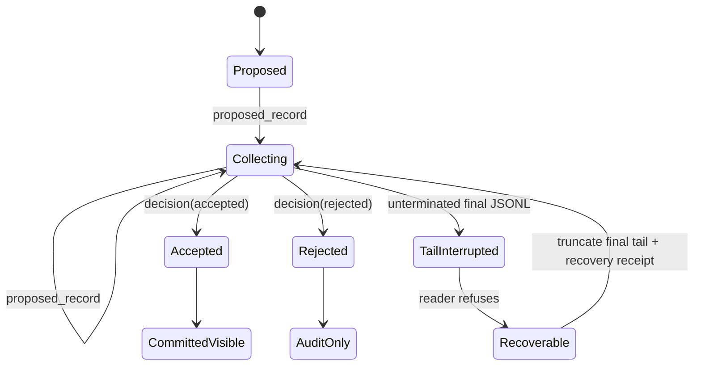

# Flowness Ledger Core candidate — technical report

Status: **public Open Alpha technical report**. This report explains a
fresh-room local module. It is not a production evaluation, external-adoption
report, or claim of wider Flowness runtime compatibility.

## D0 — the human problem

Many automation failures are not failures to write data; they are failures to
distinguish a draft from a decision. If a downstream consumer sees half of a
proposal before it has been accepted, it can act on work that will later be
rejected. The candidate makes that distinction explicit and inspectable.

## D1 — one-sentence contract

Records may be durable before they are visible, but committed visibility is
created only by an immutable accepted decision.

## D2 — lifecycle

The audit JSONL stream is authoritative. `Ledger.read("committed")` is a
derived reader: it yields only proposal records whose terminal decision is
`accepted`. Rejected records remain auditable but invisible to that reader.

## D3 — mechanism and failure behavior

Each append has a sequence number, prior-record hash and record hash. A
duplicate record ID, broken hash link, malformed complete line or conflicting
decision fails closed. An unfinished *final* JSONL line is different: the
reader refuses until bounded recovery truncates only that tail. Recovery can
persist a self-hashed receipt bound to the resulting ledger prefix; a verifier
checks that receipt after later appends without pretending it describes the
newest head.

The committed-type projection has a watermark covering the complete audit
head. Its values come only from committed rows, but an accepted, rejected or
pending append makes the prior projection stale. A stale read refuses until a
deterministic rebuild writes a new projection hash and watermark.

## D4 — evidence available locally

The package tests cover pending invisibility, grouped accepted visibility,
rejected invisibility, conflict refusal, incomplete-tail recovery, receipt
tampering, projection tampering, stale-read refusal and deterministic rebuild.
The `change-evidence-demo` creates an inspectable run manifest; the
semantic-trial runner preserves raw verified trial results and failures rather
than averaging them into a score. A local Python 3.12 fresh virtual environment
has built and installed the candidate wheel offline. The local wheel-install
receipt tool binds the exact wheel, installed module and console-script bytes,
then requires the installed command to create and separately verify a demo.

These are local package evidence. A future exact release record must separately
bind the sealed export and a non-author Linux aarch64 / CPython 3.12 clean-room
result; that external acceptance remains a pre-release requirement. Neither
source proves production durability, performance, distributed ordering,
exactly-once delivery, real Agent orchestration, external adoption or customer
value.

## D5 — operational and authority boundary

The candidate is POSIX-local because it relies on `fcntl`. It does not provide
Windows behavior, NFS correctness, replication, leader election, distributed
consensus, secrets handling or a hosted service. A caller can propose and
decide; it cannot mutate a prior immutable decision. Nothing here authorizes a
release or a channel post.

## Open Alpha boundary

The current offer is a public Open Alpha local slice plus evidence-bounded
research materials. Before publication, a future exact release record must
bind its public export, rights, versioned artifact, non-author clean-room
evidence, negative E2E, and fresh jury/owner gates. Trust-primitive Beta
additionally requires external use,
incident/maintenance evidence and repeatable raw trials. The detailed
machine-readable status remains in the Flowness OSS readiness registry.

## What would falsify this report

Any changed source, demo artifact, FAQ, mechanism card or claimed evidence must
be re-bound in the Content Graph. A failed raw trial, stale projection,
different source snapshot, missing rights review or server/runtime gap lowers
the claim rather than being averaged away.
